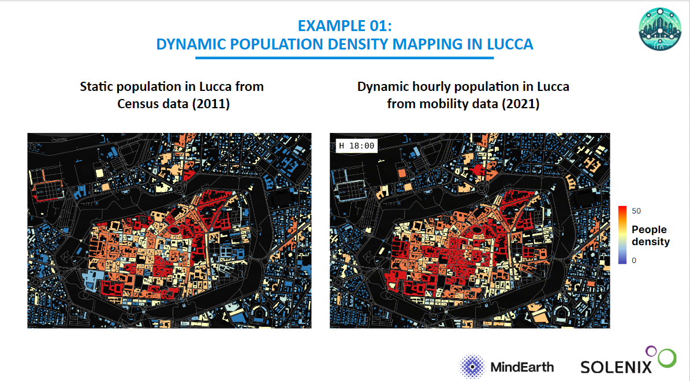

|  |   |
|-------------------------------------------------|--------------------------------------------------|

F

CITYNEXUS

Use Case Promotion Package

Solenix Engineering GmbH

Project Ref.: SLXENGDE/CITYNEXUS/2023

Doc. Ref.: SLXENGDE-CITYNEXUS-D5.5

| Title:                | CITYNEXUS                                                                                                                                                                                                                                                                                                              |
|-----------------------|------------------------------------------------------------------------------------------------------------------------------------------------------------------------------------------------------------------------------------------------------------------------------------------------------------------------|
| Volume:               | Use Case Promotion Package                                                                                                                                                                                                                                                                                             |
| Customer:             | Starion Italia S.p.A                                                                                                                                                                                                                                                                                                   |
| Customer Reference:   | CS301353.Docref.0001                                                                                                                                                                                                                                                                                                   |
| Project Reference:    | SLXENGDE/CITYNEXUS/2023                                                                                                                                                                                                                                                                                                |
| Document Reference:   | SLXENGDE-CITYNEXUS-D5.5                                                                                                                                                                                                                                                                                                |
| Date:                 | 02/07/2025                                                                                                                                                                                                                                                                                                             |
| Version:              | 05.01                                                                                                                                                                                                                                                                                                                  |
| Document Responsible: | Simone Fratini                                                                                                                                                                                                                                                                                                         |
| Author(s):            | Consortium Team                                                                                                                                                                                                                                                                                                        |
| Approved:             | Technical Officer                                                                                                                                                                                                                                                                                                      |
| Company:              | Solenix Engineering GmbH Phone: +49 6151 870 91 0 Spreestrasse 3 E-Mail: info@solenix.de 64295 Darmstadt Internet: www.solenix.de Germany                                                                                                                                                                              |
|                       | The copyright of this document is vested in the European Space Agency. This document may only be reproduced in whole or in part, stored in a retrieval system, transmitted in any form, or by any means, e.g. electronically, mechanically or by photocopying, or otherwise, with the prior permission of the Agency.  |

**  
**

**Document Log**

| Revision | Date       | Responsible    | Comment                                                               |
|----------|------------|----------------|-----------------------------------------------------------------------|
| 01.00    | 07/02/2024 | Simone Fratini | Document Creation                                                     |
| 01.01    | 07/03/2024 | Simone Fratini | Document Update after RR1                                             |
| 02.00    | 22/05/2024 | Simone Fratini | Document Update for RR2. Section 3 and 4 updated.                     |
| 03.00    | 16/09/2024 | Simone Fratini | Document Update for RR3. Section 4 and 5 updated.                     |
| 04.00    | 03/12/2024 | Simone Fratini | Document Update for CCN1-MS1. Section 5 Updated                       |
| 04.01    | 18/12/2024 | Simone Fratini | Update for RIDs resolution.                                           |
| 05.00    | 22/05/2025 | Simone Fratini | Update for FR. Section 3.4, 4 and 5 Updated. Section 6 added.         |
| 05.01    | 02/07/2025 | Simone Fratini | Update for RIDs resolution. MOOC description updated & minor editing. |

Distribution List

| Name                 | Organisation         |
|----------------------|----------------------|
| Technical Officer    | Starion Italia S.p.A |
| CITYNEXUS Consortium | Solenix, MindEarth   |

Table of Content

[Distribution List](#_Toc202801204)

[1 Scope and Purpose](#_Toc202801205)

[1.1 Document Structure](#_Toc202801206)

[2 Applicable and reference documents](#_Toc202801207)

[2.1 Applicable Documents](#_Toc202801208)

[2.2 Reference Documents](#_Toc202801209)

[2.3 Acronyms and Abbreviations](#_Toc202801210)

[3 Stakeholder Engagement](#_Toc202801211)

[3.1 Tier One stakeholders](#_Toc202801212)

[3.2 Tier Two stakeholders](#_Toc202801213)

[3.3 Other stakeholders](#_Toc202801214)

[3.4 Engagement Plan](#_Toc202801215)

[4 End user meetings and workshops](#_Toc202801216)

[4.1 Bilateral meetings](#_Toc202801217)

[4.2 User Requirements Workshop](#_Toc202801218)

[4.3 Use Case Results Validation Workshop](#_Toc202801219)

[5 Dissemination of Findings](#_Toc202801220)

[5.1 Conferences and events](#_Toc202801221)

[5.2 Web and social media](#_Toc202801222)

[6 Knowledge transfer](#_Toc202801223)

[6.1 Training material](#_Toc202801224)

[6.2 Massive Open Online Course (MOOC)](#_Toc202801225)

# Scope and Purpose

This document is the deliverable D5.5 – Use Case Promotion Package for the CITYNEXUS project.

## 1.1 Document Structure

-   Stakeholder Engagement
-   End User Meetings and Workshops
-   Dissemination of Findings
-   Knowledge Transfer

# Applicable and reference documents

## 2.1 Applicable Documents

| Ref.     | Document Title                                          | Reference/Link                                                                                              |
|----------|---------------------------------------------------------|-------------------------------------------------------------------------------------------------------------|
| ITT      | Invitation to Tender                                    | CS301353.Docref.0001, 18/04/2023                                                                            |
| STC      | Special Conditions of Tender                            | Appendix 3 to RHEA CS301353.Docref.0001, 18/04/2023                                                         |
| SOW      | Statement of Work                                       | CS301353.Docref.0002, 18/04/2023                                                                            |
| ITT      | Invitation to Tender                                    | CS301353.Docref.0001, 18/04/2023                                                                            |
| PROP-TP  | Technical Proposal                                      | SLXENGDE-CITYNEXUS-PRP-02-TP                                                                                |
| PROP-MIP | Managerial and Implementation Proposal                  | SLXENGDE-CITYNEXUS-PRP-03-MIP                                                                               |
| AD-02    | Scrum as Agile project management                       | <https://www.scrum.org/>                                                                                    |
| AD-03    | Agile Software Development Handbook, Issue 1 April 2020 | [ECSS-E-HB-40-01A](https://ecss.nl/home/ecss-e-hb-40-01a-agile-software-development-handbook-7-april-2020/) |

## 2.2 Reference Documents

| Ref.   | Document Title                                               | Reference/Link           |
|--------|--------------------------------------------------------------|--------------------------|
| RD-01  | CITYNEXUS - Project Management Plan for Use Case Application | SLXENGDE-CITYNEXUS-D5.1  |
| RD-02  | CITYNEXUS - Software Release Plan                            | SLXENGDE-CITYNEXUS-SRP   |
| RD-03  | CITYNEXUS - Software Requirement Specification               | SLXENGDE-CITYNEXUS-SRS   |
| RD-04  | CITYNEXUS - Software Verification & Validation Plan          | SLXENGDE-CITYNEXUS-SVVP  |

## 2.3 Acronyms and Abbreviations

| Acronym  | Description                                                             |
|----------|-------------------------------------------------------------------------|
| AI       | Artificial Intelligence                                                 |
| ESA      | European Space Agency                                                   |
| ESOC     | European Space Operations Centre                                        |
| EUMETSAT | European Organisation for the Exploitation of Meteorological Satellites |
| ITT      | Invitation to Tender                                                    |
| KOM      | Kick-off Meeting                                                        |
| KPI      | Key Performance Indicator                                               |
| ML       | Machine Learning                                                        |
| SOW      | Statement of Work                                                       |
| SW       | Software                                                                |
| TO       | Technical Officer                                                       |
| WBS      | Work Breakdown Structure                                                |
| WP       | Work Package                                                            |
| XAI      | Explainable AI                                                          |

# Stakeholder Engagement

CITYNEXUS aims to enhance sustainable urban development by improving air quality and promoting sustainable mobility. In this sense, it aims to be key tool for assessing the impact of infrastructural and mobility transformations on quality of life, health, and climate at both local and urban/regional scales. The engagement of LCAV and the broader awareness and involvement of the larger user community is crucial for tailoring CITYNEXUS to meet specific local requirements, thereby facilitating its adoption for effective urban planning. The following section outlines the envisioned outreach and promotion package that shall support the implementation of the CITYNEXUS system in this sense. With the support of UrbanDigital.dk stakeholders that will be targeted by outreach and engagement activities have been divided into two main categories: '*Tier One*' and '*Tier Two*' stakeholders.

## Tier One stakeholders

Tier One stakeholders include departments and offices directly responsible or more closely involved in the potential covering of the Øresund motorway. These are identified as high-priority entities to be consistently engaged throughout the project. These are listed in the table below:

These primarily include:

-   **Vejdirektoratet:** Entity responsible for Denmark's state-owned roads, covering over 3,700 km, about 5% of the country's total road network. These roads cater to around 45% of Denmark's road traffic. The Directorate prioritizes environmental considerations and aims to ensure safe, secure, and convenient travel for people and goods. Key responsibilities include planning, constructing, maintaining, and expanding state-owned roads, with a focus on modernizing over 1,000 km of motorways.
-   **Sund & Bælt**: Entity owned 100 % by the state. The company has the overall responsibility of operating and maintaining the major fixed links in Denmark. They have conducted a comprehensive environmental impact assessment (miljøkonsekvensvurdering) for the proposed transformation of the Øresundsmotorvejen. The assessment aimed at reducing congestion and enhancing safety on the motorway. The environmental impact report considers various factors, including traffic and environmental consequences of expanding the motorway. Sund & Bælt has also reviewed multiple solution proposals received from citizens and authorities during the project's idea phase in 2022, incorporating several into the final project proposal.
-   **CPH By&Havn** (City & Port Development): As one of Denmark’s largest urban development corporations, CPH By&Havn is owned by the City of Copenhagen (55%) and the State (45%) and plays a crucial role in urban development and infrastructure projects in Copenhagen. One of its key roles is to develop urban areas in the Copenhagen districts of Ørestaden and Nordhavnen. By & Havn has played a pivotal role in the development of Ørestad and has been involved in several projects within the district. These include educational institutions like Copenhagen University’s Humanities Faculty and the IT University, as well as Media City.

## Tier Two stakeholders

Tier Two stakeholders feature representatives for the 12 nearby municipalities who might have a vested interests in the CITYNEXUS initiative due to existing challenges related to traffic / air quality who have formed a petition group to lobby at national level. These include:

-   **Høje Taastrup**: in the Capital Region of Denmark, houses approximately 55,000 residents. It features an important its transportation infrastructure, notably the Holbæk Motorway that links key cities like Copenhagen, Roskilde, and Holbæk. Recent years have seen rising concerns over air pollution, particularly due to motorway traffic. The Air Quality Index (AQI) often indicates elevated levels of particulate matter and nitrogen dioxide, exceeding the World Health Organization's 24-hour maximum limits. Proactively addressing these environmental challenges, the municipality has embarked on an ambitious plan to eliminate fossil fuel usage. This strategy includes transitioning from natural gas heating to district heating systems and heat pumps, targeting completion by 2026.
-   **Vallensbæk**: located in the Capital Region of Denmark, is part of the Greater Copenhagen area and is one of Denmark's smallest municipalities in terms of area. The municipality is connected to key transportation routes, including the Køge Bugt Motorway, which runs through the southern part of the town, and the Holbæk Motorway, which passes through its northern part, linking the area to key locations in the Greater Copenhagen area. Existing motowarys are cause of substantial environmental pollution in the area. To reduce the impact of noise pollution on residents living near the busy Køge Bugtmotorway, Vallensbæk Municipality commissioned the construction of 570 meters long and 4 meters high noise barrier on the southern side of the highway.
-   **Rødovre**: located in the Capital Region, is a part of the larger Copenhagen conurbation. It is flanked by the European route E47, a motorway-grade thoroughfare, part of the international E-road network. This route connects Lübeck in Germany to Helsingborg in Sweden, via Copenhagen and is heavily trafficked. While no specific studies have been carried out in Rødovre Municipality, a 2014-2015 study by the Danish Road Directorate aimed at mapping of air quality along motorways and highways in Denmark, including the E47 motorway, highlighted how the geographical variation of nitrogen dioxide (NO2) and particulate matter (PM10 and PM2.5) concentrations, with concentrations found on the busiest motorways.
-   **Gladsaxe**: located in the northwestern suburbs of Copenhagen, in the Capital Region of Denmark, has a population of about 70,000. In the last few years, the Muncipality has been proactive in addressing environmental and urban mobility issues and has embarked on ambitious climate adaptation projects, focusing on creating a balance between social and environmental aspects and promoting urban mobility solutions. One of their significant initiatives is the Gladsaxe Heights project, a climate-adapted neighbourhood that integrates outdoor life with new climate adaptation projects. From these initiatives, it is evident from these projects that the municipality is mindful of environmental quality and public health, especially in areas with higher social exposure.
-   **Tårnby:** located on the island of Amager and neighboring Copenhagen Municipality, is significantly influenced by its transportation infrastructure and the Copenhagen Airport, which occupies about 19% of its area. In addition to the Airport, the E20 Amager Motorway/Øresund Motorway, a major transportation route, runs through Tårnby, connecting to the Øresund Bridge to Sweden and the Kalvebod Bridge to Hvidovre municipality, an infrastructure that plays a crucial role in both local and regional transportation dynamics. In recent years several major infrastructural developments are anticipating substantial changes in the district. In particular, the Tårnby local council recently approved a development plan for an Airport Business Park at the airport, aiming to transform it into a Northern European air cargo hub. This project is expected to double the airport’s cargo capacity from 500,000 to 1,000,000 tonnes annually. To support this development, the local road network, including the improvement of the large roundabout at Kystvejen, will be developed to handle the growth and mitigate traffic-related challenges. This is part of Tårnby's strategy to manage increased traffic and avoid congestion associated with the airport's expansion. While these developments are set to boost the local economy and transportation capabilities, they might also have implications for air quality and traffic congestion.

## Other stakeholders

In addition to Tier One and Tier Two stakeholders, additional stakeholders have been identified by the end user. These entities, while indirectly involved in the decisions targeted by CITYNEXUS, are pivotal components of Amager and Copenhagen's urban ecosystem and should be kept informed about the project's developments.

-   **Ørestad Innovation City Copenhagen (ØICC)** is an innovation and collaboration hub that promotes Ørestad as a green innovation district in Copenhagen. ØICC brings together various stakeholders, including educational institutions, startups, and public and private companies, to collaborate on projects that address current challenge and focus on improving urban living through sustainable practices. This is achieved through collaboration with members and partners on various projects and working groups.
-   **Copenhagen Airport (CPH Airport)**, located in Kastrup on the island of Amager, near Ørestad, is the main international airport serving Copenhagen and the wider Oresund Region. It's the largest airport in Scandinavia and one of the oldest international airports in Europe. CPH Airport's role as a significant transport hub enhances Ørestad's connectivity and appeal for businesses and residents, aligning with Ørestad's vision of innovation and sustainable urban growth.
-   **The Metro Company**, operates the Copenhagen Metro, a rapid transit system serving the city and the greater Copenhagen area. This plays a crucial role in the city's public transportation network, connecting key areas including residential neighbourhoods, business districts, and the Copenhagen Airport. It's known for its driverless, fully automated trains and frequent services, which significantly contribute to Copenhagen's reputation as a city with a strong emphasis on sustainable and convenient urban transportation. M1 of the Copenhagen Metro, running from from Vanløse to Vestamager, connects the Ørestad neighbourhood to the city center. While passing through Ørestad, the metro runs on an elevated line, while it is tunneled below the city centre.
-   **Field's shopping mall** is one of Denmark's largest shopping centres, located in Ørestad. It serves as a major retail and entertainment hub for the district and the wider Copenhagen area. The mall contributes to the vibrancy of Ørestad, attracting shoppers and visitors, and plays a role in creating a lively and dynamic atmosphere in this modern urban district.

## Engagement Plan

The CITYNEXUS engagement strategy was initially structured around a sequence of co-design, validation, and dissemination activities, in close cooperation with key local stakeholders in Copenhagen. However, it is important to acknowledge that the engagement plan encountered substantial delays and constraints due to external factors beyond the control of the consortium. Most notably, the concurrent and independent development of the DestinE platform, which exhibited significant operational and technical challenges throughout the project, impacted the availability and stability of CITYNEXUS for demonstration and interaction. In particular, CITYNEXUS was only published on the DestinE platform in **May 2025**, substantially later than originally anticipated. This delay directly affected the timing and feasibility of core engagement activities, such as the **Knowledge Transfer Workshop** planned in Copenhagen. Given the proximity of the start of the successor initiative **CITYNEXUS PRO** (scheduled for **late August 2025**), this workshop will now be integrated into that upcoming project framework.

Despite these challenges, the consortium has ensured meaningful stakeholder interaction and validation, adapting the engagement plan dynamically to evolving circumstances and making use of available opportunities. The table below outlines the engagement actions carried out, with adjustments as needed.

Table 1 presents an overview of the stakeholder’s engagement plan.

Table 1 - Stakeholder’s engagement plan

| Action                              | Tasks                                                                                                                                                                                                           | Time frame         | Status                                                |
|-------------------------------------|-----------------------------------------------------------------------------------------------------------------------------------------------------------------------------------------------------------------|--------------------|-------------------------------------------------------|
| **Collection of user requirement**  | Schedule and conduct initial meetings in Danish with Tier 1 stakeholders to introduce CITYNEXUS, facilitated by UrbanDigital.                                                                                   | Month 1-3          | Completed                                             |
|                                     | Host a workshop inviting stakeholders to contribute ideas and requirements for CITYNEXUS.                                                                                                                       | Month 3-5          | Completed                                             |
| **User Testing**                    | Begin regular usability testing with end users to gather actionable feedback.                                                                                                                                   | From Month 5       | Completed                                             |
| **Use Case Results Validation**     | Multiple live demos (1:1 and 1:5) during ESA Living Planet Symposium 2025                                                                                                                                       | Month 13 (shifted) | Completed                                             |
| **Knowledge Transfer**              | Organize a comprehensive workshop in Copenhagen for hands-on training and live demonstrations.                                                                                                                  | Month 14 (shifted) | Rescheduled (CITYNEXUS –PRO )                         |
|                                     | Develop and introduce a CITYNEXUS MOOC module in collaboration with DestinE.                                                                                                                                    |                    | Completed                                             |
| **Dissemination of Findings**       | Share outcomes and lessons learned with broader communities, including local councils and academic institutions. Utilize various platforms for dissemination, such as conferences, journals, and online forums. | Throughout         | Ongoing – will continue beyond the end of the project |

# End user meetings and workshops

## Bilateral meetings

The consortium conducted a series of initial bilateral meetings with key stakeholders from LCAV, focusing on both tier-one and tier-two members, depending on their availability. These meetings, led by UrbanDigital in Danish, aimed to raise project awareness, provide an overview, and gather initial feedback. The sessions revealed significant interest from tier-one organizations. Specifically, LCAV expressed interest in incorporating CITYNEXUS into their citizen engagement process and utilizing real-time calculations to assess changes in urban spaces. Additionally, they provided data on noise levels from the vicinity of motorways. The City of Copenhagen showed a keen interest in digital twins and their potential applications, particularly regarding noise issues around motorways in Amager and Ryparken. Silent City demonstrated interest in leveraging new data sources to enhance their existing regulatory framework. Follow-ups are planned to delve deeper into these interests and explore potential collaborations.

## User Requirements Workshop

On April 23rd, a 2-hour online workshop was conducted at 10 AM, bringing together both tier-one and tier-two representatives involved in the CITYNEXUS project. This workshop aimed to deliver a comprehensive technical overview to the attendees. Among the key objectives were the definition of Key Performance Indicators (KPIs) such as how the UI should support existing workflows, how CITYNEXUS can assist planners in meeting legal requirements, and the identification of data requirements and access protocols.

The workshop was well-received with 10 confirmed attendees, including representatives from 10 municipalities who provided solid inputs. This includes the Municipalities of Furesø, Gentofte, Gladsaxe, Glostrup, Greve, Hvidovre, Ishøj, Lyngby-Taarbæk, Rødovre, Vallensbæk and Gate21, plus other interested stakeholders including the Silent City organization. It was furthermore requested that the workshop be conducted in Danish, so as to ensure clear communication for all participants.

The municipalities represented in the workshop are in the suburban areas surrounding Copenhagen, encompassing major motorways to and around the city. Given the limited regulatory influence at the local level, these municipalities often negotiate with the state agency, the Road Directorate.

Many municipalities reported a high proportion of citizens affected by traffic noise exceeding recommended limits. Home to numerous industries, these areas see significant commuter traffic. Ongoing scenarios involving noise protection and motorway covering were discussed, highlighting the active dialogue between municipalities and the Road Directorate. Some mayors leverage press access to address noise burdens, while speed reduction on local roads is a preferred noise mitigation strategy.

The presentation began with an overview of the mobility data, showcasing traffic patterns and congestion points within the area, featuring specific visualizations of the mobility model and air quality data (particularly NOx) in an interactive HTML format. Displayed visualizations were crafted to be user-friendly, allowing attendees to provide comments and feedback in real time.

This visual data integration with NOx air quality measurements demonstrated how environmental impacts could be assessed using the CITYNEXUS platform. A detailed discussion ensued regarding the representativeness of the mobility data compared to actual mobility dynamics occurring in Copenhagen. The audience expressed a high level of satisfaction, agreeing that the data accurately reflected real-world conditions. This feedback was crucial as it validated the accuracy and reliability of the mobility model used by CITYNEXUS. The audience was highly satisfied with the accuracy of the data, noting that it effectively reflected real-world conditions.

In this occasion it was noted how each municipality features a diverse mix of transport drivers, including commuters, work and business-related trips, leisure-related trips, local tours, delivery, and business transport distributed among different transport mode. Cars remain the predominant transport mean, with many people using cars even for short distances. Data collection is a common practice across municipalities, involving counts on both large and small roads, typically using hose measurements to capture data on number, speed, and vehicle type (excluding pedestrians). Municipalities collect this data in Masdra, the national cadaster, and are mindful of the potential impacts of seasonal and weather variations on measurements. This data was pointed to the consortium as a useful source of information to improve the credibility of the model and to validate it. This feedback was crucial for the credibility of the CITYNEXUS mobility model.

An in-depth discussion followed, focusing on the NOx values and the need for data outputs to be both recognizable and within familiar ranges to maintain user trust. Two main points emerged from this discussion. First, the data must align with users' expectations to ensure trust and usability. Second, it is essential that the data meets regulatory and health impact standards. The process of transforming raw emission data into volume density (e.g., mcg/m³) was examined, considering factors such as the dimensions of the road and a reference height. The feedback gathered was invaluable, guiding the integration of these insights into the CITYNEXUS platform while ensuring both technical accuracy and user-friendliness. This collaborative effort underscored the importance of user engagement in refining the platform.

This phase is designed to further refine the CITYNEXUS tool, leveraging real-world applications and user feedback to enhance its functionality and usability. During the workshop, representatives from various municipalities shared their insights and highlighted several key functionalities they deemed essential.

One of the primary functionalities requested was fast update speed. Participants emphasized that quick updates are crucial not only for streamlining work processes but also for engaging with citizens effectively. The ability to receive rapid updates ensures that municipal staff can respond swiftly to changes and keep the public informed in real-time. Another critical functionality discussed was the need for quick feedback on changes. Municipalities expressed the importance of being able to see the immediate consequences of actions such as road closures, speed reductions, and the implementation of noise protection measures. This capability allows planners to make informed decisions and adjust strategies promptly based on real-time data.

Impact analysis was also a significant area of interest. Representatives stressed the necessity of understanding how many people would be affected by various traffic interventions, such as road closures or noise abatement efforts. They highlighted the need for detailed information about the specific locations, times, and areas impacted, which would enable more precise and effective planning. Additionally, there was a strong interest in traffic type analysis. Municipalities wanted to identify the different types of traffic within specific polygons, such as short trips, commuters, and business transport. This detailed analysis would help them better understand traffic patterns and make more informed decisions to improve overall traffic management and urban planning.

At the workshop's conclusion, participants emphasized the necessity of grounding their feedback on initial simulation results to evaluate the UI's usability and understand the tool's decision-making support value. This feedback led to the planning of a new round of testing, set to commence after the first official release of the full model workflow, including both the modeling and simulation components, scheduled for June. The workshop on April 23rd successfully engaged participants from various municipalities, providing valuable insights and feedback on the CITYNEXUS project. The detailed discussions and interactive visualizations helped validate the mobility model and address key concerns related to NOx data and user expectations. Plans for further testing and refinement reflect a commitment to developing a robust and user-friendly platform that meets the needs of urban planners and stakeholders. The collaboration and feedback from the participating municipalities will be instrumental in ensuring the success of the CITYNEXUS project, paving the way for a more informed and responsive approach to urban planning and environmental management.

## Use Case Results Validation Workshop

The original plan for validating the CITYNEXUS use case involved a dedicated results workshop in Copenhagen, aimed at showcasing the platform to key local stakeholders and collecting structured feedback through hands-on sessions. However, this activity was significantly impacted by the delayed and problematic availability of the DestinE platform—an independently developed infrastructure outside the control of the CITYNEXUS consortium. Due to persistent technical and integration challenges, the CITYNEXUS service was only deployed and made available to users on the DestinE in **May 2025**.

Given the extremely limited timeframe between service publication and the scheduled project closure, the consortium adapted its validation strategy. The **ESA Living Planet Symposium (LPS) 2025**, taking place in **Vienna the week before the project’s formal closure meeting**, was identified as an optimal alternative venue. At LPS, CITYNEXUS has been prominently showcased at a dedicated booth, where the team delivered multiple live demonstrations—both one-to-one and small group sessions (up to five participants)—to a variety of stakeholders including urban planners, ESA representatives, research institutions, and policy advisors.

These interactive sessions covered core platform functionalities, including “what-if” simulation capabilities, explainable AI modules, and dynamic visualisation of mobility, air quality, and urban planning scenarios. The demos allowed stakeholders to directly interact with the platform and express qualitative feedback on usability, relevance, and potential integration into decision-making workflows. This feedback, gathered during the symposium, provided valuable insights into the maturity and readiness of CITYNEXUS at the conclusion of the project.

Although not originally foreseen as the primary validation format, the LPS 2025 showcase proved highly effective, compensating for the inability to conduct the originally planned in-situ event in Copenhagen.

Importantly, the **Knowledge Transfer Workshop** in Copenhagen, while no longer feasible within the current CITYNEXUS timeline, is now scheduled to take place as part of the upcoming **CITYNEXUS PRO** initiative, which begins in **late August 2025**. This follow-on project will build on the outcomes of CITYNEXUS, allowing for deeper engagement and validation activities with stakeholders in Denmark and beyond.

Additionally, the CITYNEXUS Massive Open Online Course (**MOOC**), completed in **early June 2025**, serves as a structured training and dissemination tool, extending the reach of the platform and supporting its broader validation and uptake efforts.

# Dissemination of Findings

## Conferences and events

-   In November 13-14, 2023, the consortium contributed with a poster to the **2nd Destination Earth (DestinE) User eXchange meeting[^1]** that took place in Bonn, Germany. This event, hosted by the European Centre for Medium-Range Weather Forecasts (ECMWF) and co-organized with the European Space Agency (ESA) and the European Organisation for the Exploitation of Meteorological Satellites (EUMETSAT), aimed to foster further engagement within the DestinE community. It served as a platform for sharing progress, listening to users’ feedback, and addressing requests, focusing on the initiative’s development and implementation.
-   On December 13, 2023, the consortium presented the proposed **DestinE use case at the Roadshow Webinar: DestinE in action – meet the first use cases[^2]**. This online event focused on presenting the first 5 DestinE use cases.
-   The consortium presented **to URBIS24 (URBan Insights from Space)**[^3], a workshop organized by ESA on September 16-18, 2024, at ESA/ESRIN in Frascati, Italy. It aims to bring together urban policymakers, Earth Observation experts, service providers, and end-users to address urban challenges and discover innovative Earth Observation-based solutions, fostering urban development through cutting-edge methods and technologies.
-   **3rd Destination Earth (DestinE) User eXchange event[^4]**, held by EUMETSAT in Darmstadt on October 15-16, 2024, highlighted the consortium's contributions to urban digital twin development. The event featured a poster presentation, a live demonstration, and a dedicated session co-chaired by Alessandra Feliciotti (MindEarth) and Simone Fratini (Solenix), showcasing the role of digital twins in addressing urban challenges like traffic management, air quality, and climate resilience. Key use cases included CityNexus, which analyzes urban infrastructure impacts on traffic and air quality, and UrbanSquare, which models climate resilience strategies such as flood mitigation. A panel discussion featuring Rasmus Reeh (UrbanDigital) emphasized the importance of user-centric design and actionable insights for municipal adoption. The consortium also contributed to sessions on the utility of the DestinE ecosystem and platform, focusing on scalability, collaboration, and public engagement.
-   **Interview with DG Connect Representatives**: The consortium participated in a video interview with representatives of DG Connect from the European Commission, alongside project stakeholders in Milan and Copenhagen. The interview, conducted in October 2024, will be edited, collated, and published in the coming months to highlight the project's achievements and its impact on sustainable urban development.
-   In February 19–21, 2025, the consortium participated in the **ESA Digital Twin Earth Components: Open Science Meeting**[^5] held at ESA/ESRIN in Frascati, Italy. The CITYNEXUS presentation focused on its use case structure, highlighting its added value compared to existing solutions, and emphasised how the platform was originally developed outside DestinE. The session provided an opportunity to share benefits and challenges encountered during the onboarding process to the DestinE, and to reflect on lessons learned related to service integration and technical alignment.
-   On March 20, 2025, the CITYNEXUS project was presented in Bologna to representatives of the Regione Emilia-Romagna. The meeting focused on the Bologna use case, attracting significant interest from the region, which is considered a leader in innovation within Italy. The discussions opened promising perspectives for follow-up collaboration in the context of smart and climate-neutral city initiatives.
-   On May 8, 2025, the consortium presented the presented at the **Living-in.EU webinar “Destination Earth: What it is and what it can offer for Local Digital Twins”[^6]**. This online event focused on presenting the DTs deployed for the DestinE.
-   CITYNEXUS was featured at the ESA **Living Planet Symposium2025**, held in Vienna from June 23–27, 2025. The consortium delivered an oral presentation under the session D. Digital Innovation and Green Solutions – Subtheme 01 Digital Twin Earth / Destination Earth. In parallel, the project was also showcased at a dedicated booth, where live demonstrations (1:1 and small group formats) were provided to illustrate the platform’s core functionalities, including scenario creation, explainable AI outputs, and environmental impact visualisation. These activities allowed direct engagement with ESA, researchers, public authorities, and the broader Earth Observation community.
-   In addition, the CITYNEXUS use case was showcased at the **4th Destination Earth (DestinE) User eXchange**⁷, held concurrently with the Living Planet Symposium in Vienna. The consortium contributed with a poster presentation, highlighting the technical and operational integration of the platform into the DestinE infrastructure. The event also provided a venue to exchange views with key institutional users and stakeholders of the DestinE ecosystem, and to reflect on the project’s contribution to the broader digital twin landscape.

[^1]: https://destination-earth.eu/event/2nd-destination-earth-user-exchange/

[^2]: https://destination-earth.eu/event/destine-in-action-meet-the-first-desp-use-cases/

[^3]: https://urbis24.esa.int/

[^4]: https://platform.destine.eu/events/3rd-destination-earth-user-exchange/\#:\~:text=We%20are%20looking%20forward%20to,both%20on%20site%20and%20online.

[^5]: https://nikal.eventsair.com/esa-digital-twin/\#introduction

[^6]: https://www.youtube.com/watch?v=Mc86FEqDSAE

These activities underline the consortium's active engagement with the DestinE community and its commitment to fostering collaboration, innovation, and knowledge-sharing across the urban development and Earth Observation sectors.

 

## Web and social media

-   Since project inception, the consortium has created and maintained a dedicated **GitHub repository[^7]** for the CITYNEXUS project. The repository will include code, documentation, and resources related to CITUNEXUS.
-   The consortium has contributed an article titled **CITYNEXUS: A Novel Urban Digital Twin Application** to the DestinE Use Cases website.
-   The consortium plans to utilize **LinkedIn** as a strategic platform to advertise events, share news, and post updates related to the CITYNEXUS project. This will leverage the professional network of consortium members and end users to reach a wide audience interested in urban development, technology, and sustainability, ensuring maximum visibility and engagement.
-   The consortium aims to publish an article on CITYNEXUS via "*Towards Data Science*", a publication hosted on Medium, leveraging the platform's engaged readership, interested in data science, technology, and urban innovation. Writing for this publication offers an opportunity to showcase CITYNEXUS cutting-edge approach to urban planning through data science and Earth Observation (EO) technologies.

[^7]: [destination-earth/DestinE_ESA_CityNexus (github.com)](https://github.com/destination-earth/DestinE_ESA_CityNexus)

 

# Knowledge transfer

## Training material

As part of the CITYNEXUS initiative for knowledge exchange, a series of concise presentations were created to familiarize end users with key concepts such as mobility data, air quality monitoring from space, digital twins, and "what-if" scenario modelling. These presentations aimed to make complex technical information accessible to non-experts, highlighting the potential of the CITYNEXUS platform for sustainable urban planning. The materials were presented during bilateral sessions and workshops and are now also accessible through the CITYNEXUS GitHub repository and the DestinE online channels. They served as foundational resources for stakeholder engagement, capacity building, and internal dissemination efforts across municipal and research stakeholders in the cities of Copenhagen, Bologna, and Seville.

  

## Massive Open Online Course (MOOC)

As part of its commitment to knowledge sharing and stakeholder empowerment, the CITYNEXUS consortium has developed a dedicated Massive Open Online Course (MOOC) titled **“CITYNEXUS: A Destination Earth Use Case for Sustainable Urban Decision-Making.”** The MOOC was finalised in **early June 2025** and officially published within the ESA DestinE User Community (DEUC) training suite. It is freely accessible to stakeholders, technical users, and interested citizens through ESA's e-learning channels.

The MOOC is a core component of the project’s long-term knowledge transfer and capacity-building strategy, designed to ensure that CITYNEXUS continues to deliver impact beyond the project’s formal conclusion. It enables a wide audience—including urban planners, policymakers, researchers, and students—to gain hands-on understanding of how to use the CITYNEXUS platform, interpret its outputs, and integrate its analytical capabilities into real-world urban planning processes.

The course is structured into six thematic units, each combining narrated walkthroughs, annotated slides, and guided exercises within the CITYNEXUS platform:

-   **Introduction to CITYNEXUS**: Presents the platform as an AI-powered urban digital simulation tool designed to address key sustainability challenges—such as traffic congestion, air pollution, and inefficient urban interventions—through scenario-based planning and data-driven analysis.
-   **What-if Analysis**: Illustrates the concept of modelling different mobility and infrastructure scenarios, including interventions like low-emission zones, tunnelled road redesigns, and vehicle fleet transformations. Emphasis is placed on how users can explore environmental and mobility trade-offs using the simulation engine.
-   **Workspace Management and User Interface**: Provides users with guidance on navigating the CITYNEXUS platform hosted on the DestinE infrastructure, including managing scenarios, selecting cities, and interacting with platform layers.
-   **Simulations Visualization and Interaction**: Demonstrates how to configure, filter, and compare results using features like dual-map view, time-based animations, and indicator filtering.
-   **Defining Your Own Scenario and Simulation**: Enables users to modify road network parameters or land use elements, simulate changes, and review model outcomes based on their custom inputs.
-   **Analysis and Visualization**: Focuses on how users can interpret key output indicators (e.g., NO₂, PM, CO₂ emissions, traffic speed, and road occupancy) to evaluate the effectiveness of interventions over time and space.

The MOOC is designed for both **technical and non-technical audiences**. Urban practitioners gain skills in simulation-based analysis and data interpretation, while academic and student audiences benefit from structured learning that supports integration into urban studies, environmental science, and public administration curricula. Key features include:

-   **Interactive learning** through simulated user journeys and results interpretation.
-   **Scenario-based thinking**, encouraging exploration of trade-offs between mobility interventions and environmental outcomes.
-   **Experience sharing**, including a dedicated section on onboarding to DestinE and challenges faced by the consortium during integration—intended to support future service providers.

By blending theoretical background, platform training, and applied case studies, the MOOC ensures that CITYNEXUS remains accessible, usable, and relevant well beyond the project’s lifespan.
