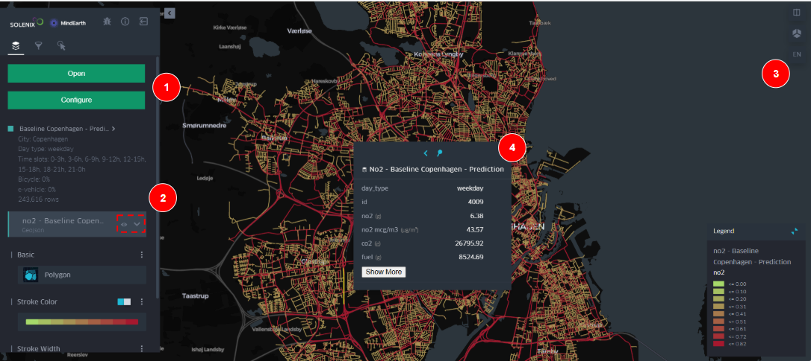
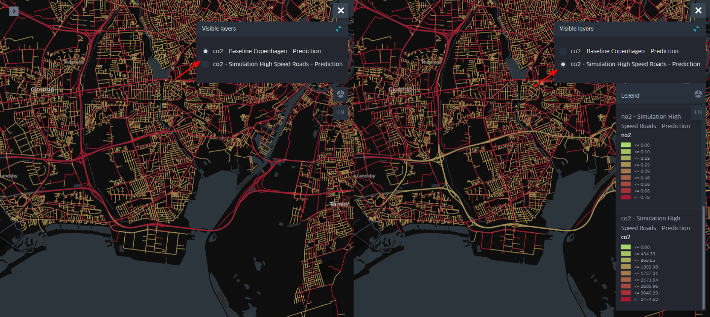

  
  <h1>CITYNEXUS<h1>
  Final Report

| Title:                | CITYNEXUS                                                                                                                                                                                                                                                                                                              |
|-----------------------|------------------------------------------------------------------------------------------------------------------------------------------------------------------------------------------------------------------------------------------------------------------------------------------------------------------------|
| Volume:               | Final Report                                                                                                                                                                                                                                                                                                           |
| Customer:             | Starion Italia S.p.A                                                                                                                                                                                                                                                                                                   |
| Customer Reference:   | CS301353.Docref.0001                                                                                                                                                                                                                                                                                                   |
| Project Reference:    | SLXENGDE/CITYNEXUS/2023                                                                                                                                                                                                                                                                                                |
| Document Reference:   | SLXENGDE-CITYNEXUS-FR                                                                                                                                                                                                                                                                                                  |
| Date:                 | 07/07/2025                                                                                                                                                                                                                                                                                                             |
| Version:              | 01.01                                                                                                                                                                                                                                                                                                                  |
| Document Responsible: | Simone Fratini                                                                                                                                                                                                                                                                                                         |
| Author(s):            | Consortium Team                                                                                                                                                                                                                                                                                                        |
| Approved:             | Technical Officer                                                                                                                                                                                                                                                                                                      |
| Company:              | Solenix Engineering GmbH Phone: +49 6151 870 91 0 Spreestrasse 3 E-Mail: info@solenix.de 64295 Darmstadt Internet: www.solenix.de Germany                                                                                                                                                                              |
|                       | The copyright of this document is vested in the European Space Agency. This document may only be reproduced in whole or in part, stored in a retrieval system, transmitted in any form, or by any means, e.g. electronically, mechanically or by photocopying, or otherwise, with the prior permission of the Agency.  |

# Distribution List

| Name                 | Organisation          |
|----------------------|-----------------------|
| Technical Officer    | Starion Italia S.p.a. |
| CITYNEXUS Consortium | Solenix, MindEarth    |

# Table of Content

[Distribution List](#_Toc207621915)

[1 Scope and Purpose](#_Toc207621916)

[1.1 Document Structure](#document-structure)

[1.2 Applicable Documents](#applicable-documents)

[1.3 Reference Documents](#_Toc207621919)

[1.4 Acronyms and Abbreviations](#acronyms-and-abbreviations)

[2 Project Overview](#project-overview)

[3 Project Organization](#_Toc207621922)

[3.1 Project Team](#_Toc207621923)

[3.2 Project Schedule & Work Packages](#project-schedule--work-packages)

[3.3 Documentation & Software Deliverables](#documentation--software-deliverables)

[4 CITYNEXUS Scenario(s)](#citynexus-scenarios)

[4.1 Copenhagen (Denmark)](#copenhagen-denmark)

[4.2 Bologna (Italy)](#bologna-italy)

[4.3 Seville (Spain)](#seville-spain)

[4.4 Aarhus (Denmark)](#aarhus-denmark)

[5 Data and Simulation Technology](#data-and-simulation-technology)

[6 Application Design and DestinE Integration](#application-design-and-destine-integration)

[7 Stakeholder Engagement, Outreach and Validation](#stakeholder-engagement-outreach-and-validation)

[8 Conclusions and Future Exploitation](#conclusions-and-future-exploitation)

# Scope and Purpose

The current document represents the Final Report deliverable for the study “CITYNEXUS”. It presents an overview of the project organization and of the work performed during this activity by Solenix Engineering GmbH and MindEarth s.r.l. under Contract “CS301353.Docref.0001”.

## Document Structure

The document is organized as it follows.

| Chapter 1            | This chapter. Provides the purpose and scope of the deliverable together with applicable and reference documents                 |
|----------------------|----------------------------------------------------------------------------------------------------------------------------------|
| Chapter 2            | Provides the background of the activity                                                                                          |
| Chapter 3            | Describes the Project Organization                                                                                               |
| Chapter 4            | Describes the Scenario(s)                                                                                                        |
| Chapter 5            | Describes Data and Simulation Technology                                                                                         |
| Chapter 6            | Presents the Application Design and the DestinE Integration Timeline                                                             |
| Chapter 7            | Discusses Stakeholder Engagement, Outreach and Validation                                                                        |
| Chapter 8            | Contains the final Conclusions and Future Exploitation of the activity                                                           |

## Applicable Documents

| Ref.     | Document Title                         | Reference/Link                                      |
|----------|----------------------------------------|-----------------------------------------------------|
| ITT      | Invitation to Tender                   | CS301353.Docref.0001, 18/04/2023                    |
| STC      | Special Conditions of Tender           | Appendix 3 to RHEA CS301353.Docref.0001, 18/04/2023 |
| SOW      | Statement of Work                      | CS301353.Docref.0002, 18/04/2023                    |
| ITT      | Invitation to Tender                   | CS301353.Docref.0001, 18/04/2023                    |
| PROP-TP  | Technical Proposal                     | SLXENGDE-CITYNEXUS-PRP-02-TP                        |
| PROP-MIP | Managerial and Implementation Proposal | SLXENGDE-CITYNEXUS-PRP-03-MIP                       |

## Reference Documents

| Ref.   | Document Title                                   | Reference/Link           |
|--------|--------------------------------------------------|--------------------------|
| RD-01  | Project Management Plan for Use Case Application | SLXENGDE-CITYNEXUS-D5.1  |
| RD-02  | Use Case Descriptor                              | SLXENGDE-CITYNEXUS-D5.2  |
| RD-03  | User Validation Report                           | SLXENGDE-CITYNEXUS-D5.4  |
| RD-04  | Use Case Promotion Package                       | SLXENGDE-CITYNEXUS-D5.5  |
| RD-05  | Use Case Exploitation Roadmap                    | SLXENGDE-CITYNEXUS-D5.6  |

## Acronyms and Abbreviations

| Acronym | Description               |
|---------|---------------------------|
| AI      | Artificial Intelligence   |
| DT      | Digital Twin              |
| EO      | Earth Observation         |
| ESA     | European Space Agency     |
| ITT     | Invitation to Tender      |
| KOM     | Kick-off Meeting          |
| KPI     | Key Performance Indicator |
| ML      | Machine Learning          |
| SOW     | Statement of Work         |
| SW      | Software                  |
| TO      | Technical Officer         |
| WBS     | Work Breakdown Structure  |
| WP      | Work Package              |
| XAI     | Explainable AI            |

# Project Overview

The Destination Earth (DestinE) initiative is a flagship EU program aimed at creating a highly accurate digital model of the Earth, combining vast data sources, advanced Earth system models, AI, cloud computing, and high-performance infrastructure. Its goal is to monitor environmental and human impacts, support climate-related policy development, and assist in sustainable urban planning through data-driven decision-making.

During the deployment of the DestinE, Use Cases have been selected to validate the platform while showcasing its potential to support policy and decision-makers in sectors affected by environmental and climate change. The Use Cases also aimed at demonstrating the key role of EO in DT applications, by delivering credible, quantifiable, and actionable predictions to support decision making and policy implementation.

In this context, this activity proposed, deployed and integrated in the DestinE, between November 2023 and June 2025, an innovative **application, CITYNEXUS**, **designed to assess the environmental, social, and economic impacts of changes in road networks, mobility, and urban space design.**

CITYNEXUS supports “what-if” and impact assessments, provides actionable, evidence-based decision support for urban planners, through explainable and interpretable results, leveraging DestinE’s technical capabilities and data lakes. The platform was originally designed to respond to the needs of the Local Council of Amager Vest, a district of the city of **Copenhagen (Denmark)**, primary end-user of the project, providing policymakers a collaborative **platform to experiment with various strategies and solutions, considering diverse factors and variables crucial for successful and sustainable urban interventions**. The platform has later been extended to include **Bologna (Italy)**, **Seville (Spain)**, and **Aarhus (Denmark)**, demonstrating its adaptability and scalability across diverse urban contexts.

The application integrates diverse data sources, including commercial mobility data, government datasets, open repositories, and DestinE data, offering a unified interface for simulation and result analysis.

The Application implementation started in November 2023 when the DestinE platform was still under deployment, and followed closely the DestinE evolution adapting the deployment and integrating the platform services. CITYNEXUS was open on the DestinE on 16 May 2025 (as Beta-Testing version).

Feedback was collected through structured reviews, expert testing, and real-world data comparisons, directly informing multiple platform refinements that improved usability, data interpretation, and visualisation. As a result, the platform was fine-tuned to meet the functional needs of urban planners and positioned for further development.

# Project Organization

## Project Team

The consortium that deployed CITYNEXUS was led by Solenix Engineering GmbH, with MindEarth s.r.l. as subcontractor. In addition, the end users were represented by UrbanDigital, engaged as an external service provider for the project.

Figure 1: Consortium Structure

As the prime contractor, Solenix Engineering GmbH managed the overall project. Together, the consortium partners brought complementary expertise and capabilities essential for the development of CITYNEXUS.

Solenix provided specialized knowledge in Software Engineering and applied AI/ML, taking the lead in CITYNEXUS's implementation and integration into the DestinE platform.

MindEarth, with its extensive expertise in spatial and mobility data analysis, remote sensing, and AI, was responsible for scenario definition, simulation technology implementation, and stakeholder engagement activities.

## Project Schedule & Work Packages

The overall activity had a duration of 20 months, from **10 November 2023 until 03 July 2025**. The work was organised in 5 work packages of various duration as presented in Table 1 and in the schedule in Figure 2.

| Task | WP ID      | WP Title                                                  | Responsible   | Start      | End        |
|------|------------|-----------------------------------------------------------|---------------|------------|------------|
| 1    | **WP1000** | **Project Management**                                    | **Solenix**   | **KO**     | **KO+20m** |
|      | WP1100     | Project Management                                        | Solenix       |            |            |
|      | WP1200     | MindEarth Project Management                              | MindEarth     |            |            |
| 2    | **WP2000** | **Agile Use Case Development**                            | **Solenix**   | **KO**     | **KO+18m** |
|      | WP2100     | Platform integration/development                          | Solenix       |            |            |
|      | WP2200     | Use Case Development                                      | MindEarth     |            |            |
|      | WP2300     | Agile management                                          | Solenix       |            |            |
|      | WP2400     | Open-Source project management                            | MindEarth     |            |            |
|      | WP2500     | Liaise with DestinE developers and other DestinE projects | Solenix       |            |            |
| 3    | **WP3000** | **Use Case Promotion**                                    | **MindEarth** | **KO+2m**  | **KO+20m** |
|      | WP3100     | Use Case Promotion - website                              | MindEarth     |            |            |
|      | WP3200     | Workshop and events                                       | MindEarth     |            |            |
|      | WP3300     | MOOC and promotion package                                | MindEarth     |            |            |
| 4    | **WP4000** | **Use Case Exploitation**                                 | **MindEarth** | **KO+8m**  | **KO+20m** |
|      | WP4100     | Use Case Exploitation                                     | MindEarth     |            |            |
| 5    | **WP5000** | **Service Implementation**                                | **Solenix**   | **KO+10m** | **KO+18m** |
|      | WP5100     | Business Model Design                                     | Solenix       |            |            |
|      | WP5200     | Model Improvement & Adaptation                            | MindEarth     |            |            |
|      | WP5300     | Service Integration & Development                         | Solenix       |            |            |

Table 1 - Project Work Breakdown Structure

Figure 2 – Project Schedule

## Documentation & Software Deliverables

The table below lists all documentation produced during this activity.

| Doc ID | Title                                               |
|--------|-----------------------------------------------------|
| D5.1   | Project Management Plan for Use Case Application    |
| D5.2   | Use Case Descriptor                                 |
| D5.4   | User Validation Report                              |
| D5.5   | Use Case Promotion Package                          |
| D5.6   | Use Case Exploitation Roadmap                       |
| SRS    | Software Requirement Specification                  |
| SVVP   | Software Verification and Validation Plan           |
| SVVR   | Software Verification and Validation Report         |
| SRF    | Software Reuse File                                 |
| SRP    | Software Release Plan                               |
| SDD    | Software Design Document                            |
| SUM    | Service User Manual                                 |
| UCS    | Use Case Sustainability Analysis Technical Note[^1] |
| FR     | Final Report                                        |
| CCD    | Contract Closure Documentation                      |

[^1]: Merged into D5.6 – Use Case Exploitation Roadmap

In terms of software, the activity integrated CITYNEXUS as a service in the DestinE Platform. The service is available here:

<https://citynexus.destine.eu/>

for all registered users. The source code and the container of the simulation model are available at the project’s public repository here:

[GitHub - destination-earth/DestinE_ESA_CITYNEXUS](https://github.com/destination-earth/DestinE_ESA_CityNexus).

# CITYNEXUS Scenario(s)

With growing concerns for environmental sustainability and urban quality of life, cities worldwide are striving to reduce traffic congestion and promote sustainable transportation. To this purpose, the City of Copenhagen - renowned for its commitment to sustainability - is exploring strategies to reimagine existing car-centric road infrastructure through transformative initiatives. Here, one of the potential interventions involves the covering of major high-speed thoroughfares and the requalification of the corresponding areas to improve air quality and quality of life in response to pressing demands of citizens and local councils.

Driven by this general focus, the CITYNEXUS scenario was originally designed to respond to the needs of the **Local Council of Amager Vest,** a district of the city of Copenhagen, primary end-user of the project, providing policymakers a **collaborative platform to experiment with various strategies and solutions**, considering diverse factors and variables crucial for successful and sustainable urban interventions, thereby **facilitating a coordinated approach to decision-making**. The platform has later been extended to include **Bologna (Italy), Seville (Spain), and Aarhus (Denmark)**, demonstrating its adaptability and scalability across diverse urban contexts.

In a broader perspective, the platform aims to facilitate **evidence-based decision-making at the municipality level** by providing capabilities to **evaluate a comprehensive set of Key Performance Indicators** (KPIs) and by implementing an **interactive system for assessing the impact of infrastructural and mobility changes** on the target KPIs through policy-relevant, user-defined 'what-if' scenario simulations.

The key thematic areas addressed in CITYNEXUS are:

-   **Mobility Patterns**: CITYNEXUS provides detailed insights into commuting patterns, travel behavior, traffic flows, congestion rates, peak traffic hours, and overall mobility dynamics in the city. This information is crucial for understanding and addressing the challenges of urban transport and traffic management.
-   **Air Quality**: The platform evaluates the concentration of various pollutants at ground level, like nitrogen dioxide (NO2), sulfur dioxide (SO2), carbon monoxide (CO), ozone (O3), black carbon particles, and ultrafine particles.
-   **Dynamic Population Distribution**: CITYNEXUS enables users to manipulate the number of people residing in different parts of a city, providing insights into how changes in residential distribution impact population movements and densities across various urban areas.
-   **Service and POI Distribution**: CITYNEXUS empowers users to adjust the number, type, and spatial distribution of various land use classes and points of interest within the city. By simulating changes in the availability and diversity of services, the platform provides detailed insights into how these modifications affect travel patterns, enabling users to evaluate the mobility impacts of introducing or reconfiguring urban services.

CITYNEXUS offers functionalities for generating **"what if" simulations** based on various transformation scenarios. Each scenario aims to contribute to a more sustainable, healthy, and liveable urban environment:

-   **"High-speed Road Redesign":** this scenario reflects ongoing discussions in the Local Council of Amager Vest and the City of Copenhagen regarding the potential transformation of high-speed road segments into tunnels and reclaiming the corresponding space for residential areas, green spaces, or recreational/leisure amenities. Accordingly, CITYNEXUS will allow simulating the tunneling of any existing road segment, while repurposing the reclaimed space above ground for other urban uses.
-   **"Electric, Low-Emission Vehicles, and Active Mobility Promotion":** this scenario responds to the City of Copenhagen's efforts to promote the adoption of electric and low-emission vehicles as well as of active mobility options as part of its sustainable transportation initiatives and climate-neutrality ambitions. To this purpose, CITYNEXUS will enable users to customize the proportion of these vehicles and modes within the overall traffic fleet.
-   **"Low Emission Zones Creation":** this scenario aligns with the City of Copenhagen's exploration of implementing low emission zones (LEZ). In this regard, CITYNEXUS will allow users to convert specific census units, neighbourhoods or manually defined areas to LEZ, where motorized circulation is prohibited or limited to specific classes of vehicles.
-   **"Road Speed Adjustment":** this scenario reflects the impact of high traffic speed on air quality and environmental pollution. Accordingly, CITYNEXUS shall enable adjustments to speed limits for specific road segments or entire categories of roads.
-   "**Greener Streets**”: this scenario supports the effort of the city of Bologna in targeting a 40% reduction in traffic-related greenhouse gas emissions by 2030. CITYNEXUS will enable the simulation of the effects of increased percent of bicycles in the traffic fleet, conversion of streets into pedestrian zones and street speed reduction, to enforces a 30 km/h speed limit in residential areas to enhance safety and reduce emissions.
-   “**Eco-mobility Campaign**”: this scenario combines the LEZ Creation scenario with the Active Mobility Promotion scenario to support the efforts of the city of Seville in increasing cycling’s modal share to nearly 6% of total urban mobility while contextually restricting high-emission vehicles in key areas to reduce pollution and enhance public health.

## Copenhagen (Denmark)

The City of Copenhagen is currently in the process of discussing plans for addressing traffic congestion in Ørestad, a mixed-use area in the Amager Vest district[^2], due to the presence of a high-speed road cutting through the heart of this neighborhood comprising residential, commercial, and university buildings. The municipality, animated by local councils and civil society organizations, plans to **transform this main thoroughfare to better manage traffic, improve air quality, and enhance living standards**. Central to this initiative is understanding the impact of different hypotheses of transformation, going beyond simple budget considerations, but also addressing broader aspects of human mobility, service accessibility, air quality, and public environmental health. The city has a strong interest in exploring innovative tools for interactive assessment of different spatial planning and urban development options and for evaluating tradeoffs of climate adaptation policies and regulatory changes, hence supporting data-driven decision-making in urban planning.

[^2]: Amager Vest is one of the ten administrative districts of Copenhagen Municipality, Denmark.

## Bologna (Italy)

Bologna faces mobility challenges due to its dense historical urban layout and a dynamic population influx of students, researchers, and professionals. The **Sustainable Urban Mobility Plan (SUMP)**[^3] targets a 40% reduction in traffic-related greenhouse gas emissions by 2030. Central to this effort are investments in cycling infrastructure, pedestrian zones, and the decarbonization of public transport, including the expansion of tram systems and the Metropolitan Railway System (SFM). Another significant initiative is the **Bologna Città 30[^4]**, implemented in 2023, which enforces a 30 km/h speed limit in residential areas to enhance safety and reduce emissions. While these measures have shown promise, challenges such as increased congestion on arterial roads and inconclusive air quality improvements highlight the need for robust evaluation tools. CITYNEXUS can assist Bologna by integrating mobility and environmental data to refine these initiatives and optimize their impact on urban liveability and sustainability.

[^3]: https://pumsbologna.it/Engine/RAServeFile.php/f/allegati/EN-DOC-SINTESI-PUMSBO.pdf

[^4]: https://www.bolognacitta30.it/

## Seville (Spain)

Seville has been a pioneer in promoting sustainable mobility and improving air quality. Its **Low Emission Zone (ZBE)**[^5], established in compliance with national regulations, restricts high-emission vehicles in key areas to reduce pollution and enhance public health. In addition, the city has invested heavily in cycling infrastructure, implementing the **2007 Bike Masterplan**[^6], which established a 120 km network of segregated cycle paths. This initiative increased cycling’s modal share to nearly 6% of total urban mobility and serves as a benchmark for other cities aiming to promote active mobility. Seville has also launched air quality measurement campaigns within its metro system, demonstrating its commitment to healthier urban environments. CITYNEXUS can complement these efforts by providing advanced analytical tools to assess and optimize the effects of these policies, ensuring data-driven decision-making for sustainable mobility planning.

[^5]: https://www.andalucia.com/cities/seville/low-emission-zone

[^6]: https://ediaqi.eu/articles/launching-air-quality-measurement-campaigns-metro-sevilla

## Aarhus (Denmark)

Aarhus is a leader in sustainability, evidenced by its **Aarhus Climate Action Plan 2021-2024[^7]**, which targets carbon neutrality by 2030. This plan includes the decarbonization of public transport, the expansion of cycling infrastructure, and measures to address suburban sprawl through smart city solutions. The city’s **Green Mobility Plan (2024)** builds on these goals by promoting active mobility and public transport as alternatives to car use, ensuring alignment with climate objectives. Aarhus’s innovative approach to sustainable mobility is further exemplified by the **Smart Mobility Project**[^8] **(2014-2017)**, which tested 22 pilot initiatives to influence commuting behaviours, reduce car dependency, and improve air quality. Complementing these efforts, the city participates in a national **Air Quality Monitoring Program[^9]**, managed by the Danish Centre for Environment and Energy (DCE) at Aarhus University. This program integrates a network of monitoring stations and atmospheric dispersion models to provide comprehensive data on pollutants such as nitrogen oxides, particulate matter, and carbon monoxide. CITYNEXUS can leverage this data to simulate and analyse the impacts of Aarhus’s policies, supporting evidence-based strategies for improving mobility and air quality.

[^7]: https://aarhus.dk/media/twoe5i23/climate-action-plan.pdf

[^8]: https://urban-mobility-observatory.transport.ec.europa.eu/resources/case-studies/aarhus-encourages-residents-trial-alternative-means-commuting_en

[^9]: https://envs.au.dk/en/research-areas/air-pollution-emissions-and-effects/the-monitoring-program

# Data and Simulation Technology

CITYNEXUS integrates diverse data sources, including commercial mobility data, government datasets, open repositories, and DestinE data.

Figure 3 - CITYNEXUS Data Sets

##### High Frequency Location-Based (HFLB) Data

CITYNEXUS integrates **High Frequency Location-Based (HFLB) data** to analyze human mobility across **Denmark, Italy, and Spain**:

-   **Denmark:** Two datasets from PickWell cover July 2019–March 2020 (aligned with CAV air quality data) and October 2022–October 2023 (an update to reflect stakeholder preference for more current data). Each dataset includes \~200,000 daily active users, representing \~3.5% of the national population, enabling detailed analysis of mobility dynamics.
-   **Italy & Spain:** Twelve months of HFLB data (Sept 2023–Aug 2024) support localized assessments in **Bologna** and **Seville**, offering critical insights into mobility trends and urban challenges.

Together, these datasets establish a consistent, comparative framework across Aarhus, Bologna, and Seville, enhancing the CITYNEXUS platform’s capacity to deliver data-driven, region-specific solutions.

##### DestinE Data Portfolio (DEDP) Datasets

CITYNEXUS leverages several high-quality datasets from the **DestinE Data Portfolio (DEDP)** to support environmental modeling, air quality analysis, and urban planning:

-   **ERA5 (ECMWF):** Hourly meteorological data (e.g., solar radiation, precipitation, temperature, boundary layer height) at \~25 km resolution, from July 2019 to present. Used for modeling surface energy balance and climate dynamics. [Dataset Link](https://hda.data.destination-earth.eu/ui/dataset/EO.ECMWF.DAT.ERA5_LAND_HOURLY)
-   **Sentinel-5P TROPOMI:** Level-2 data on NO₂, SO₂, O₃ concentrations and cloud fraction at 5.5 x 3.5 km resolution. Critical for air quality mapping and impact simulation. [Dataset Link](https://hda.data.destination-earth.eu/ui/dataset/EO.ESA.DAT.SENTINEL-5P.TROPOMI.L2)
-   **CORINE Land Cover:** 100m-resolution dataset covering 44 land use types across Europe, essential for emissions and land dynamics analysis. [Dataset Link](https://hda.data.destination-earth.eu/ui/dataset/EO.CLMS.DAT.CORINE)
-   **Daily Global Forecast (Digital Twin on Extremes):** High-resolution (4.4 km) 4-day weather forecasts from the IFS-NEMO model, including key meteorological fields and vertical profiles. [Dataset Link](https://hda.data.destination-earth.eu/ui/dataset/EO.ECMWF.DAT.DT_EXTREMES)

##### Publicly available datasets

-   **Global Wind Atlas (GWA):** Wind speed data at 250m resolution, capturing fine-scale dynamics relevant for energy and urban planning.
-   **EEA AirBase (Poland & Germany):** High-resolution air quality data (PM, NO₂, O₃) from monitoring stations, used for trend analysis and model validation.
-   **Google Environmental Insights Explorer (EIE)**: The EIE Air Quality Lab data collected in Copenhagen includes measurements of nitrogen dioxide (NO₂), black carbon, and ultrafine particles. Data is gathered using a Google Street View car equipped with environmental sensors that drive through various urban areas, capturing real-time air quality data.

##### Simulation Models

CITYNEXUS simulation technology is based on:

-   **Deep Gravity Model**: This AI-based model leverages deep learning to process vast datasets and uncover complex mobility patterns. It can generate origin-destination (OD) matrices as outputs for specific mobility scenarios simulating flows between locations for any urban agglomeration by leveraging information such as tessellation, population distribution, and travel demand data, making it a robust tool for predicting and analysing mobility trends under various scenarios. Compared to traditional gravity models, it offers enhanced adaptability and deeper insights thanks to the explainable-AI features.
-   **SUMO Model**: Developed by the Institute of Transportation Systems at DLR, SUMO is an advanced, open-source traffic simulation package designed for microscopic and continuous traffic modelling in large networks. SUMO is specifically designed for microscopic and continuous traffic modelling in large networks, supporting intermodal simulation that includes pedestrian traffic. Thanks to its advanced demand generation tools, utilizing traffic counts, origin-destination (OD) matrices, and virtual population models, SUMO provides a comprehensive toolkit for detailed analysis of traffic flows in complex urban environments, creating realistic traffic demand profiles. In the proposed system, SUMO will rely on the outputs of the Deep Gravity model (e.g. OD matrices) to simulate detailed vehicle movements over typical weekdays and weekend days, providing information on congestion, vehicle speed, and other traffic metrics.
-   **Fast Model**. This is a streamlined alternative to the full SUMO implementation, using a regression-based framework built with XGBoost, a tree-based model. It replaces the computationally intensive microscopic traffic simulation of SUMO by leveraging the same input data—road network attributes (e.g., centrality, topography, speed limits, open/closed road statuses), traffic composition (e.g., the percentage of electric vehicles and bicycles), and street occupancy. Trained on patterns derived from previously generated SUMO outputs, the model predicts pollutant metrics directly by replicating the relationship between traffic dynamics and air quality metrics. This approach delivers faster and more efficient predictions while maintaining analytical accuracy.

To support evidence-based decision making at the municipality level, CITYNEXUS operates at the **local scale**. To characterize the seasonal patterns of human mobility and, in turn, their relationships to the targeted KPIs, CITYNEXUS operates on a **quarterly temporal scale** and to differentiate the analyses between **typical weekdays and weekends.**

##### Output Data

CITYNEXUS provides simulations of pollutants concentration and mobility statistics. The following pollutants are simulated (total production per road segment in a time slot of 3h):

-   NO₂, Nitrogen dioxide (provided in grams and in micrograms per cubic meter, a mass concentration unit, often used by environmental protection agencies to set regulatory limits). NO₂ is a major air pollutant with significant implications for human health and the environment. It contributes to the formation of tropospheric ozone (smog), it is a precursor to acid rain and it plays a role in the formation of fine particulate matter (PM2.5).
-   CO₂, Carbon dioxide (provided in grams), is a key greenhouse gas and a critical component of the carbon cycle. CO₂ traps heat in Earth’s atmosphere, contributing to global warming. Dissolved in water contributes to ocean acidification, lowering ocean pH and affecting marine life. It is a major driver for climate regulation.
-   NOₓ, Nitrogen Oxides (provided in grams). NOₓ gases are formed mostly during high-temperature combustion processes, like those in engines, power plants, and industrial boilers. NOₓ have major environmental and health impact, contribute to ground-level ozone (smog) formation, they are precursor to fine particulate matter (PM2.5) and affect ecosystems and vegetation by nutrient overload (eutrophication).
-   PMₓ, Particulate Matter (provide in grams), a crucial component in air pollution studies. PMₓ are linked to respiratory diseases, cardiovascular issues, and premature death. Major sources of PMₓ are: vehicle emissions, industrial activities, power plants (especially coal-fired) and constructions/demolitions.
-   HC, Hydrocarbons (provided in grams), organic compounds made up of hydrogen (H) and carbon (C) atoms. They are typically found in fuels, oils, and many industrial chemicals. In the context of air quality and emissions, HCs generally refers to unburned or partially burned fuel components released into the air. Health and environmental impacts of HCs include the following: some HCs, such as benzene, are carcinogenic; they may exacerbate asthma and other respiratory conditions; they react with NOₓ in sunlight to form ozone (O₃); and they contribute to smog formation.
-   CO, Carbon monoxide (provided in grams), a toxic gas for humans and animals. CO reduces oxygen delivery to organs and tissues, reacts in the atmosphere to form O₃ in the presence of NOₓ and sunlight and has an indirect impact on climate by affecting the atmospheric lifetime of methane and other greenhouse gases.

Additionally, the following mobility related statistics are simulated, for vehicles occupying a road segment in a time slot (3h):

-   Fuel consumption: in grams (sum) per road segment
-   Traffic speed: average, in km/h
-   Occupancy: in number of vehicles passing through or stationing.

# Application Design and DestinE Integration

The CITYNEXUS Application implementation started in November 2023 when the DestinE platform was still under deployment, and followed closely the DestinE evolution adapting the deployment and integrating the platform services. CITYNEXUS was open on the DestinE on 16 May 2025 (as Beta-Testing version).

Figure 4 - CITYNEXUS Deployment Timeline

A high-level view of the service architecture is shown in Figure 5. The architecture of **CITYNEXUS** is composed of multiple API pods and a persistent volume, all deployed on a **Kubernetes node** within the **DestinE Platform**, where they interact with various **DestinE services**.

Users access CITYNEXUS through its G**UI.** Through this interface, they can perform key actions such as downloading scenarios, launching simulations, and retrieving results. These operations are handled via the **CITYNEXUS API**, which routes simulation requests to the appropriate **Mobility Model API** based on the selected city. All data—including default scenario definitions, user-defined scenarios, and simulation results—is stored across different directories within a **persistent volume**.

**Authentication and authorization** are managed by the CITYNEXUS API using **DestinE IAM services**. Additionally, the **Mobility Model APIs** access the **DestinE Data Lake** to retrieve up-to-date weather data from the **Extremes Digital Twin (DT)** dataset.

Figure 5 - CITYNEXUS Architecture

The CITYNEXUS frontend is based on [kepler.gl](https://kepler.gl/), a widely used open-source GIS system. The application allows the definition of scenarios, simulation and result analysis. Scenarios are defined by specifying:

-   Road segment properties: including closing streets to traffic, converting streets into tunnels and limiting the allowed max speed.
-   Hexagonal grid properties: including defining land use type and Points of Interest (POI) in an area.
-   The percentage of bicycles and electric vehicles in circulation over the total number of vehicles.
-   The type of the day: weekday or weekend.
-   A set of 3-hour timeslots: three hours is the minimum simulation timeframe.

Once the scenario is defined, the what-if analysis can be performed, by interacting with the simulation results (see Figure 6):

Figure 6 - Basic layer visualization

1.  The left-side panel is the main way to configure the visualization, filter and explore the data, load another simulation or scenario.
2.  Just below, the user will see each open scenario and associated layers identified by a color.
3.  On the right-side panel, the user can open and pin the layer legend on the map, set a 3D view, and switch to a dual-map view for making comparisons between the data.
4.  By hovering the mouse over a layer, the layer’s attribute information will be displayed.

A dual map visualization is also available to ease comparison and differential analysis (see Figure 7).

Figure 7 - Dual Map View

CITYNEXUS integrates several services of the DestinE platform:

-   **Identity and Access Management (IAM)**, to manage registered DestinE users access and data protection.
-   **DestinE Data Access (Polytope)**, to streamline data access from the DestinE datalakes.
-   **Monitoring Services**, to collect active and passive KPI metrics and sends them to the DestinE Monitoring Service.

# Stakeholder Engagement, Outreach and Validation

The **Local Council of Amager Vest (LCAV)** in Copenhagen, represented by **UrbanDigital**, was the primary user of CITYNEXUS. LCAV’s strong focus on sustainable urban development has shaped the project from the outset, with UrbanDigital serving as the interface between the consortium and local stakeholders.

Key eengagement aactivities have been pursued along all the project lifecycle, including:

-   **Stakeholder Mapping:** Identified Tier 1 stakeholders (Core partners requiring continuous engagement—LCAV, infrastructure operators, and city departments) and Tier 2 stakeholders (engaged for visibility, future collaboration, and scale-up opportunities)
-   **Bilateral Meetings:** Held with LCAV and other key stakeholders, mostly in Danish, to gather expectations and introduce the use case.
-   **Co-Creation Workshop:** Conducted early on to collect system requirements and define KPIs collaboratively.
-   **Iterative User Testing:** Started in Month 4, allowing stakeholders to provide feedback on platform usability, data layers, and scenario tools.
-   **Platform Validation**: The CITYNEXUS platform was presented and validated through **live demonstrations** and an **oral presentation** at the **ESA Living Planet Symposium 2025** in Vienna. This provided an excellent opportunity to showcase the platform to a wide range of stakeholders, gather feedback, and demonstrate its capabilities in real-world urban planning scenarios..The service was showcased 7 times in the booth and an oral presentation was given. During the group presentations in the booth, more attendees showed up than expected (originally planned for five, but many more participated). The session was interactive, with attendees asking numerous questions about how to use the tool. Some even began experimenting with it on the spot. At the booth, we had a live connection to the platform, allowing people to try it directly. This hands-on access led to spontaneous feedback, both in person and later via email. The feedback primarily focused on usability and the user interface, rather than the simulation aspects. This experience showed strong user interest but also pointed to areas for improvement in accessibility and onboarding.
-   A **MOOC** was published in June 2025 to support training and outreach.
-   **Dissemination:** CITYNEXUS was showcased at multiple events including the **ESA Digital Twin Earth Open Science Meeting**, **DestinE User eXchange**, and a regional presentation in Emilia-Romagna.

This structured engagement ensured that CITYNEXUS remained aligned with real-world urban planning needs and policy priorities. Several Tier 2 actors have expressed interest in future collaboration.

The **MOOC** is a six-unit online course designed to train both technical and non-technical audiences in using the platform for sustainable urban planning. It combines narrated walkthroughs, annotated slides, and hands-on exercises. The course includes:

1.  **An Introduction to CITYNEXUS,** presenting an overview of the platform as an AI-powered urban simulation tool tackling traffic, pollution, and urban inefficiencies through data-driven, scenario-based planning.
2.  **What-if Analysis,** to ddemonstrate modelling of interventions like low-emission zones and road redesigns, highlighting trade-offs in mobility and environmental outcomes.
3.  **Workspace & UI Navigation,** to gguides users in managing scenarios, selecting cities, and interacting with DestinE-hosted platform layers.
4.  **Simulation Visualization,** to explain tools like dual-map view, animations, and filters to explore simulation outputs.
5.  **Scenario Definition,** to enable users to create custom interventions by modifying network or land use elements and reviewing resulting impacts.
6.  **Output Analysis,** focuses on interpreting indicators such as NO₂, PM, CO₂ emissions, traffic speed, and road occupancy.

This approach ensures long-term usability and relevance of CITYNEXUS across professional practice and academic learning.

The user validation strategy for CITYNEXUS was designed to reflect both the exploratory nature of a research prototype and the operational expectations of a service within the DestinE ecosystem. Accordingly, the validation activities followed a multi-layered methodology combining structured reviews, practical testing, and observational feedback across different user profiles and use contexts.

Beyond technical performance, validation focused on:

-   Usability and user experience;
-   Clarity of outputs and data interpretation;
-   Accessibility and transparency for a diverse audience, including municipal staff, environmental analysts, and policy-makers.

A **participatory and iterative validation process** was applied, combining structured methods (e.g., documented reviews) with informal feedback (e.g., demos, bilateral meetings). Core workflows, like selecting interventions, launching simulations, and interpreting indicators, were assessed for functionality and decision-making value. The validation activities included:

-   Expert reviews by the **ESA Technical Officer;**
-   **UX-led usability testing** and walkthroughs;
-   Iterative feedback from **UrbanDigital** (Copenhagen stakeholder lead);
-   External validation against **vehicle count datasets;**
-   **Live demonstrations** and feedback during the **ESA Living Planet Symposium 2025**.

Validation was seen as an ongoing effort. Feedback led to immediate platform improvements and informed the development roadmap for **future improvements**, ensuring continued service evolution.

# Conclusions and Future Exploitation

**CITYNEXUS** leverages a cutting-edge **platform like DestinE,** EO data and advanced AI to support urban resilience and environmental management. By integrating geospatial intelligence, heterogeneous data sources, and AI modelling, it enables scenario-based decision-making for sustainable urban and regional development. CITYNEXUS’s key application areas include:

1.  **Climate Adaptation for Public Stakeholders.** CITYNEXUS allows European cities to simulate and assess the impacts of climate-related interventions—such as road redesigns or low-emission zones—on **air quality, noise, and liveability**. Currently developed for Copenhagen, Aarhus, Seville, and Bologna, the approach is scalable across Europe in alignment with the EU’s climate adaptation goals.
2.  **Computational Geoscience & Local-Scale Modelling.** The platform combines EO, meteorological (e.g. ERA5), mobility, and sensor-based pollution data to model the environmental and mobility impacts of urban interventions. It enables **predictive planning** at both local and regional scales.
3.  **Data Integration & DestinE Service Usage.** CITYNEXUS draws extensively from the **DestinE Data Portfolio** (e.g., Sentinel-5P, ERA5, MERRA-2, Copernicus DEM, CORINE Land Cover), and the **four-day global simulations** from the **DestinE Digital Twin for Weather-Induced Extremes**, demonstrating full alignment with the EU’s digital infrastructure and supporting integration with broader **EU data strategies**.
4.  **Urban and Regional Development Support.** Designed to inform policy and planning decisions, CITYNEXUS helps stakeholders visualize the effects of infrastructural and policy changes, promoting **sustainable mobility**, reduced environmental impact, and enhanced urban quality of life.

Identified possible use cases for commercial exploitation of CITYNEXUS include:

-   **Policy Impact Simulation.** Enables cities to simulate policies (e.g., low-emission zones, speed limits) and assess outcomes on **traffic, emissions, and public health**—supporting evidence-based decisions and stakeholder communication.
-   **Urban Design & Redevelopment Assessment.** Helps planners evaluate how urban regeneration (e.g., converting industrial zones) affects **mobility, accessibility, and air quality**, ensuring balanced, sustainable development.
-   **Infrastructure Change Analysis.** Models the impact of large-scale projects (e.g., tunnelling motorways) on **travel patterns, pollution, and land use**, supporting more effective and community-focused investments.

To ensure the long-term sustainability of **CITYNEXUS** within the **DestinE ecosystem**, the consortium successfully applied for and was awarded a contract to further develop the service and maintain its operation—providing a **free tier on DestinE for at least two years**. The enhanced version of the service will incorporate **simulation capabilities for extreme weather events**, such as **urban flooding**, as well as an **air quality model** to evaluate the environmental impacts of flooding and infrastructure interventions. These features aim to support **urban resilience** and **public health planning**.

Possible future exploitation of CITYNEXUS to offer commercial "what-if" scenario services and decision-support tools tailored to the needs of **municipalities, urban planners, policymakers, and public agencies** focused on sustainable urban development is also possible. In fact, traditional planning tools often rely on static data or narrowly focused analyses, lacking integration between mobility, environmental, and infrastructural factors, lacking robust scenario simulation capabilities and offering limited scalability or transparency. CityNexus conversely addresses these gaps through a digital twin platform that integrates simulation, analytics, and AI. It enables users to test urban interventions virtually, reducing risks, optimizing decisions, and improving public trust.

