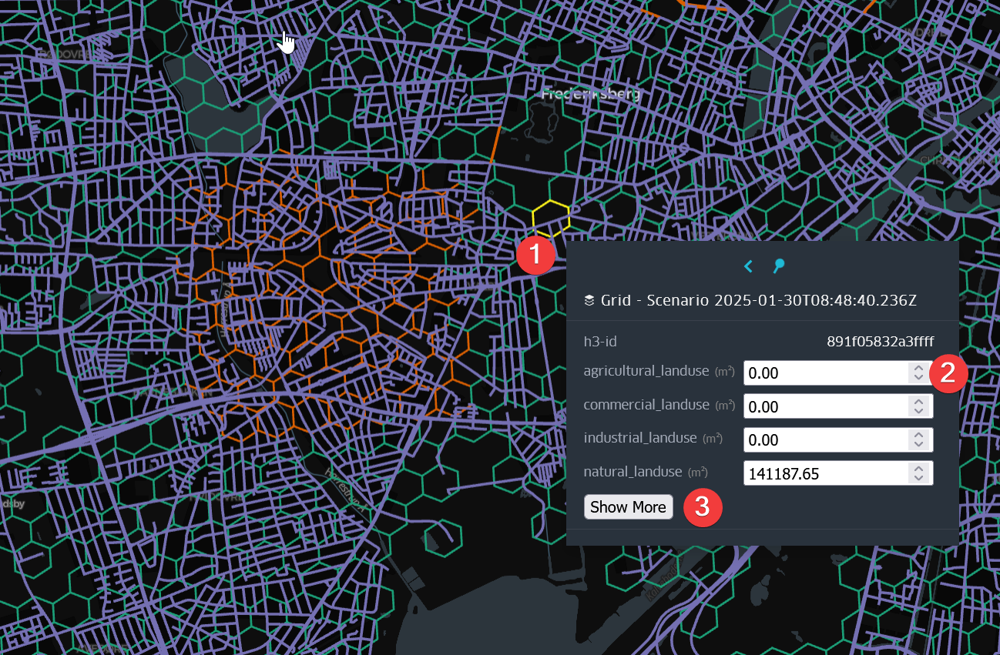
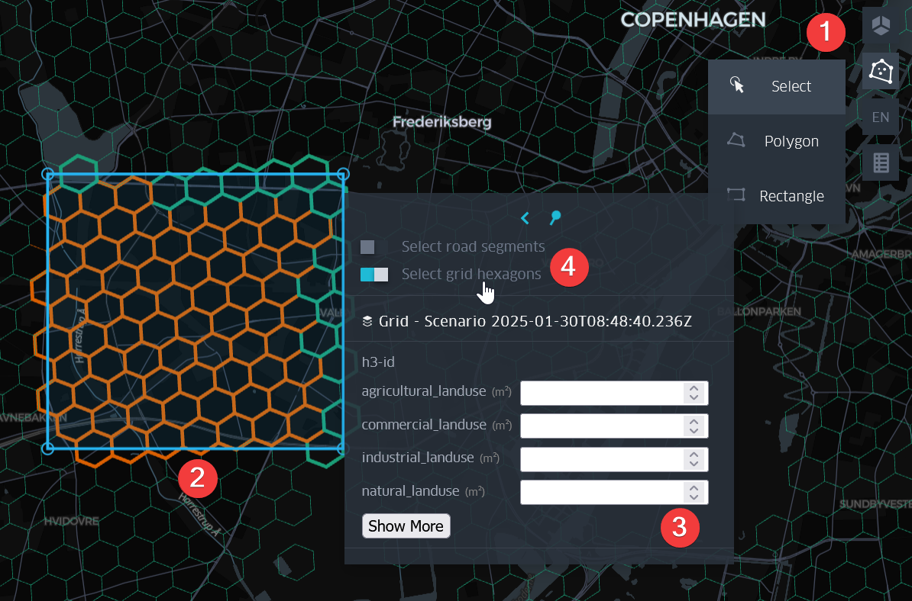
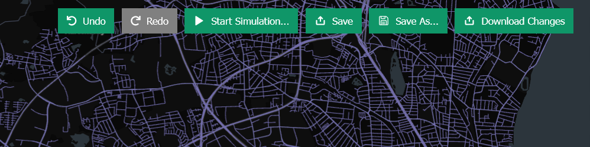
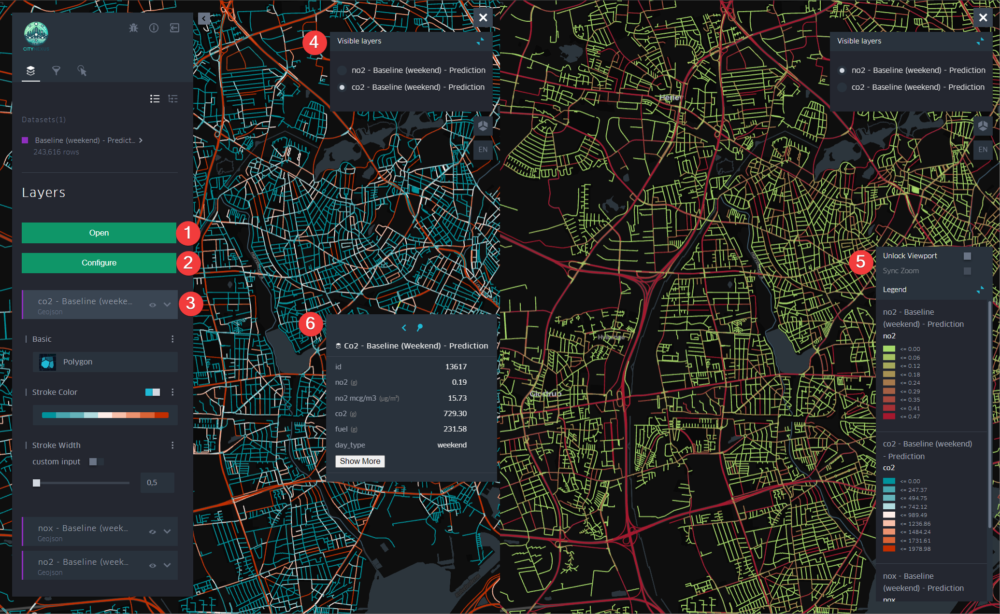

|  |   |
|-------------------------------------------------|--------------------------------------------------|

CITYNEXUS

Service User Manual

Solenix Engineering GmbH

Project Ref.: SLXENGDE/CITYNEXUS/2023

Doc. Ref.: SLXENGDE-CITYNEXUS-SUM

| Title:                | CITYNEXUS                                                                                                                                                                                                                                                                                                              |
|-----------------------|------------------------------------------------------------------------------------------------------------------------------------------------------------------------------------------------------------------------------------------------------------------------------------------------------------------------|
| Volume:               | Service User Manual                                                                                                                                                                                                                                                                                                    |
| Customer:             | Starion Italia S.p.A                                                                                                                                                                                                                                                                                                   |
| Customer Reference:   | CS301353.Docref.0001                                                                                                                                                                                                                                                                                                   |
| Project Reference:    | SLXENGDE/CITYNEXUS/2023                                                                                                                                                                                                                                                                                                |
| Document Reference:   | SLXENGDE-CITYNEXUS-SUM                                                                                                                                                                                                                                                                                                 |
| Date:                 | 18/06/2025                                                                                                                                                                                                                                                                                                             |
| Version:              | 02.00                                                                                                                                                                                                                                                                                                                  |
| Document Responsible: | Simone Fratini                                                                                                                                                                                                                                                                                                         |
| Author(s):            | Consortium Team                                                                                                                                                                                                                                                                                                        |
| Approved:             | Technical Officer                                                                                                                                                                                                                                                                                                      |
| Company:              | Solenix Engineering GmbH Phone: +49 6151 870 91 0 Spreestrasse 3 E-Mail: info@solenix.de 64295 Darmstadt Internet: www.solenix.de Germany                                                                                                                                                                              |
|                       | The copyright of this document is vested in the European Space Agency. This document may only be reproduced in whole or in part, stored in a retrieval system, transmitted in any form, or by any means, e.g. electronically, mechanically or by photocopying, or otherwise, with the prior permission of the Agency.  |

**  
**

**Document Log**

| Revision | Date       | Responsible    | Comment                                |
|----------|------------|----------------|----------------------------------------|
| 01.00    | 18/12/2024 | Simone Fratini | Document Creation                      |
| 02.00    | 18/06/2025 | Simone Fratini | Update for FR. General content update. |

Distribution List

| Name                 | Organisation          |
|----------------------|-----------------------|
| Technical Officer    | Starion Italia S.p.a. |
| CITYNEXUS Consortium | Solenix, MindEarth    |

Table of Content

[Distribution List](#_Toc207624417)

[1 Scope and Purpose](#_Toc207624418)

[1.1 Document Structure](#_Toc207624419)

[2 Applicable and reference documents](#_Toc207624420)

[2.1 Applicable Documents](#applicable-documents)

[2.2 Reference Documents](#_Toc207624422)

[2.3 Acronyms and Abbreviations](#acronyms-and-abbreviations)

[3 CityNexus Platform Overview](#_Toc207624424)

[4 CITYNEXUS User Manual](#citynexus-user-manual)

[4.1 Workspace Management & User Interface](#workspace-management--user-interface)

[4.2 Simulations Visualization & Interaction](#simulations-visualization--interaction)

[4.2.1 Basic Visualizations](#basic-visualizations)

[4.2.2 Applying Filters](#applying-filters)

[4.2.3 Change Base map](#change-base-map)

[4.2.4 Dual map view](#dual-map-view)

[4.3 Scenario Definition & Simulation](#scenario-definition--simulation)

[4.3.1 Defining a scenario](#defining-a-scenario)

[4.3.2 Starting a new simulation](#starting-a-new-simulation)

[4.4 Analysis & Visualization](#analysis--visualization)

# Scope and Purpose

This document is the User Manual for the CITYNEXUS service.

## Document Structure

-   Platform Overview
-   CITYNEXUS User Manual

# Applicable and reference documents

## Applicable Documents

| Ref.     | Document Title                                          | Reference/Link                                                                                              |
|----------|---------------------------------------------------------|-------------------------------------------------------------------------------------------------------------|
| ITT      | Invitation to Tender                                    | CS301353.Docref.0001, 18/04/2023                                                                            |
| STC      | Special Conditions of Tender                            | Appendix 3 to RHEA CS301353.Docref.0001, 18/04/2023                                                         |
| SOW      | Statement of Work                                       | CS301353.Docref.0002, 18/04/2023                                                                            |
| ITT      | Invitation to Tender                                    | CS301353.Docref.0001, 18/04/2023                                                                            |
| PROP-TP  | Technical Proposal                                      | SLXENGDE-CITYNEXUS-PRP-02-TP                                                                                |
| PROP-MIP | Managerial and Implementation Proposal                  | SLXENGDE-CITYNEXUS-PRP-03-MIP                                                                               |
| AD-02    | Scrum as Agile project management                       | <https://www.scrum.org/>                                                                                    |
| AD-03    | Agile Software Development Handbook, Issue 1 April 2020 | [ECSS-E-HB-40-01A](https://ecss.nl/home/ecss-e-hb-40-01a-agile-software-development-handbook-7-april-2020/) |

## Reference Documents

| Ref.   | Document Title                                               | Reference/Link           |
|--------|--------------------------------------------------------------|--------------------------|
| RD-01  | CITYNEXUS - Project Management Plan for Use Case Application | SLXENGDE-CITYNEXUS-D5.1  |
| RD-02  | CITYNEXUS - Software Release Plan                            | SLXENGDE-CITYNEXUS-SRP   |
| RD-03  | CITYNEXUS - Software Requirement Specification               | SLXENGDE-CITYNEXUS-SRS   |
| RD-04  | CITYNEXUS - Software Verification & Validation Plan          | SLXENGDE-CITYNEXUS-SVVP  |
| RD-05  | CITYNEXUS - Use Case Promotion Package                       | SLXENGDE-CITYNEXUS-D5.5  |

## Acronyms and Abbreviations

| Acronym  | Description                                                             |
|----------|-------------------------------------------------------------------------|
| AI       | Artificial Intelligence                                                 |
| ESA      | European Space Agency                                                   |
| ESOC     | European Space Operations Centre                                        |
| EUMETSAT | European Organisation for the Exploitation of Meteorological Satellites |
| ITT      | Invitation to Tender                                                    |
| KOM      | Kick-off Meeting                                                        |
| KPI      | Key Performance Indicator                                               |
| ML       | Machine Learning                                                        |
| SOW      | Statement of Work                                                       |
| SW       | Software                                                                |
| TO       | Technical Officer                                                       |
| WBS      | Work Breakdown Structure                                                |
| WP       | Work Package                                                            |
| XAI      | Explainable AI                                                          |

# CityNexus Platform Overview

CITYNEXUS is an **innovative urban digital twin application** designed to assess the environmental, social, and economic impacts of changes in road networks, mobility, and urban space design.

Leveraging the DESP/DestinE system, CITYNEXUS aims to **evaluate baseline conditions for human mobility**, including key indicators like air quality, population distribution, public health, and service accessibility and integrates **live what-if scenario capabilities**.

The platform is designed to provide policymakers with a **collaborative platform** to experiment with various strategies and solutions, considering diverse factors and variables crucial for successful and sustainable urban interventions, thereby facilitating a **coordinated approach to decision-making**.

The CityNexus platform aims to facilitate **evidence-based decision-making at the municipality level** by providing capabilities to **evaluate a comprehensive set of Key Performance Indicators** (KPIs) and by implementing an **interactive system for assessing the impact of infrastructural and mobility changes** on the target KPIs through policy-relevant, user-defined 'what-if' scenario simulations.

Currently, strategic decisions related to mobility and infrastructural interventions are primarily driven by economic constraints, thus overlooking the complex and multifaceted impacts on neighborhoods and local communities. This issue is further exacerbated by limited coordination and communication between districts of the same city or neighboring municipalities, hence making it challenging to assess the holistic impact of a specific intervention on nearby areas.

To address these limitations, CITYNEXUS offers policymakers a collaborative environment where they can freely experiment with different strategies and solutions. It provides a comprehensive decision-making framework that goes beyond simplistic cost considerations and considers the specific needs expressed by the user community (reflected in the selected KPIs). In this regard, CITYNEXUS targets a set of KPIs (preliminary identified together with the end users) addressing different thematic areas, namely:

-   Mobility Patterns: CITYNEXUS provides detailed insights into commuting patterns, travel behavior, traffic flows, congestion rates, peak traffic hours, and overall mobility dynamics in the city. This information is crucial for understanding and addressing the challenges of urban transport and traffic management.
-   Air Quality: The platform evaluates the concentration of various pollutants at ground level, like nitrogen dioxide (NO2), sulfur dioxide (SO2), carbon monoxide (CO), ozone (O3), black carbon particles, and ultrafine particles.
-   Dynamic Population Distribution: CITYNEXUS describes human presence patterns over time, aiding in the understanding of population movements and densities in different city areas.
-   Public Environmental Health: The platform assesses how air pollution affects public health, including the incidence of diseases associated with exposure to different pollutants.
-   Service Accessibility: It evaluates the availability, accessibility, and equity of key urban services such as transportation, healthcare, education, workplaces, commercial, and recreational facilities.

To support evidence-based decision making at the municipality level, CITYNEXUS operates at the local scale. To characterize the seasonal patterns of human mobility and, in turn, their relationships to the targeted KPIs, CITYNEXUS is intended to operate on a quarterly temporal scale and to differentiate the analyses between typical weekdays and weekends. On the one hand, this allows deriving statistically robust baseline conditions when characterizing the reference patterns for human mobility and the different KPIs. On the other hand, this enables a more realistic and nuanced understanding of the effects of “what-if” mobility and infrastructural changes at different times of the year.

Four cities acre currently available for demonstration purposes in the platform: **Copenaghen (Denmark), Bologna (Italy), Seville (Spain), and Aarhus (Denmark)**. These cities were selected as first targets for their alignment with the project’s focus on sustainable mobility, air quality improvement, and urban innovation. In principle all cities participating in the EU Mission for 100 Climate-Neutral and Smart Cities by 2030 underscore a shared commitment to climate adaptation and sustainable urban development, hence they are candidates for future adaptations and extensions of the platform.

The CITYNEXUS models have been trained using:

-   From top to toe Frequency Location Based (HFLB) mobility data
-   Sentinel-5P TROPOMI Level2 daily tropospheric NO2, SO2, CO, O3 vertical column densities
-   Copernicus Digital Elevation Model of Europe at 10m resolution
-   ECMWF ERA5 hourly estimates for different meteorological variables
-   CORINE Land Cover from the Copernicus Land Monitoring Service at 100m

# CITYNEXUS User Manual

CITYNEXUS offers the capability of implementing “what if” analysis, where users are given the possibility to assess the effects of different types of interventions on the mobility patterns and all other targeted KPIs. In this case, pre-defined scenarios are available for the cities, including:

1.  High-speed Road Redesign: this scenario regards the potential transformation of high-speed road segments into tunnels and reclaiming the corresponding space for residential areas, green spaces, or recreational/leisure amenities. It reflects ongoing discussions in the City of Copenhagen but has also a general validity.
2.  Electric, Low-Emission Vehicles, and Active Mobility Promotion: this scenario responds to the efforts to promote the adoption of electric and low-emission vehicles as well as of active mobility options as part of its sustainable transportation initiatives and climate-neutrality ambitions. This scenario responds an effort of the City of Copenhagen, but has also a general validity. To this purpose, CITYNEXUS enables users to customize the proportion of these vehicles and modes within the overall traffic fleet.
3.  Low Emission Zones Creation: this scenario allows users to convert specific census units, neighborhoods or manually defined areas to LEZ (Low Emission Zones), where motorized circulation is prohibited or limited to specific classes of vehicles.
4.  Road Speed Adjustment: this scenario reflects the impact of high traffic speed on air quality and environmental pollution. Accordingly, CITYNEXUS enables adjustments to speed limits for specific road segments or entire categories of roads.
5.  Greener Streets: this scenario supports the effort of the city of Bologna in targeting a 40% reduction in traffic-related greenhouse gas emissions by 2030. CITYNEXUS enables the simulation of the effects of increased % of bicycles in the traffic fleet, conversion of streets into pedestrian zones and street speed reduction, to enforce a 30 km/h speed limit in residential areas to enhance safety and reduce emissions.
6.  Eco-mobility Campaign: this scenario combines the Low Emission Zone Creation scenario with the Active Mobility Promotion scenario to support the efforts of the city of Seville in increasing cycling’s modal share to nearly 6% of total urban mobility while contextually restricting high-emission vehicles in key areas to reduce pollution and enhance public health.

The scenarios are first defined by specifying:

-   Road segment properties: including closing streets to traffic, converting streets into tunnels and limiting the allowed max speed.
-   Hexagonal grid properties: including defining land use type and Points of Interest (POI) in an area.
-   The percentage of bicycles and electric vehicles in circulation over the total number of vehicles.
-   The type of the day: weekday or weekend.
-   A set of 3-hour timeslots: three hours is the minimum simulation timeframe.

Once the scenario is defined, the what-if analysis can be performed. In this case, for the previously selected parameters and timeslots CITYNEXUS provides a simulation of:

-   Pollutants Concentration: 5 different pollutants including CO2, CO, HC, NOx and PMx.
-   Mobility Statistics: Fuel Consumption, Average Speed and Road Occupancy.

Figure 1 shows an overview of the CITYNEXUS framework, for enabling simulations in the demonstration cities. The six pre-defined scenarios are available on the platform but also, the user can create new scenarios by adjusting parameters such as the road network, land use, and vehicle types. Using these conditions, the system will then simulate traffic flow, congestion points, and air quality allowing the user to explore different outcomes and results that can be analyzed through interactive maps and animations.

Figure 1. CITYNEXUS framework.

## Workspace Management & User Interface

To start interacting with the CITYNEXUS digital twin, the user has to register on the DestinE platform. However, it is also possible to access the platform as a guest user. The main difference is that guest users will have limited access to the platform’s features.

Once logged in, the user is redirected to the Workspace Management & User Interface (UI).

The workspace hosts the scenarios and simulations for the four demonstration cities, for each city the user will find:

1.  The city baseline map: this is the baseline conditions for the city, without any intervention defined.
2.  Pre-defined scenarios for the what-if analysis
3.  Scenario’s Simulation results: model predictions for subsequent analysis and visual inspection.

In the top left corner of the gallery a dropdown menu can be used to select the city of interest, filter scenarios and predictions accordingly. Several options are available for the user to interact with the data. The button "Load Scenario" allows you to visualize the scenario properties and parameters to change. The button "Show Results" allows you to view the simulation outcomes, or predictions. There is also the possibility to "Delete Scenario", however this option is only available for scenarios created by the user.

Figure 2. Scenario Selection.

A “Reload” button is also available to reload the scenarios and predictions. If needed, this can be useful to update the processing status of pending simulations.

The simulation results are displayed in a table shown by clicking on the “Show Results” button on a scenario. The table indicates the conditions defined for the simulation, such as whether it was set for specific hours or for the entire day, for weekdays or weekends, and the percentage of each vehicle type.

Simulations results can be filtered to make it easier for the user to select the simulation they are interested in. The user can filter by timeslot, processing status, weekday or weekend.

The table also allows the user to delete or download existing simulations.

Figure 3. Simulations results.

When a simulation is selected, a window will pop up allowing the user to configure the visualization of the simulation. Here, the user can select which parameters they want to display. Each selected parameter will be displayed in its own visualization layer. The user can also select the dataset from which the chosen parameters will be visualized. This allows the user to view the same parameter for one or multiple scenarios. Once all parameters are selected, the user must click 'Configure' to load them onto the map.

If the user wants to keep the default visualization settings, they can simply click 'Cancel' or close the window.

Figure 4. Simulation visualization settings.

As mentioned in previous sections, the output of a simulation provides pollutants concentration and mobility statistics.

The following pollutants are simulated (total production per road segment in a time slot of 3h):

-   NO₂, Nitrogen dioxide (provided in grams and in micrograms per cubic meter, a mass concentration unit, often used by environmental protection agencies to set regulatory limits). NO₂ is a major air pollutant with significant implications for human health and the environment. It contributes to the formation of tropospheric ozone (smog), it is a precursor to acid rain and it plays a role in the formation of fine particulate matter (PM2.5).
-   CO₂, Carbon dioxide (provided in grams), is a key greenhouse gas and a critical component of the carbon cycle. CO₂ traps heat in Earth’s atmosphere, contributing to global warming. Dissolved in water contributes to ocean acidification, lowering ocean pH and affecting marine life. It is a major driver for climate regulation.
-   NOₓ, Nitrogen Oxides (provided in grams). NOₓ gases are formed mostly during high-temperature combustion processes, like those in engines, power plants, and industrial boilers. NOₓ have major environmental and health impact, contribute to ground-level ozone (smog) formation, they are precursor to fine particulate matter (PM2.5) and affect ecosystems and vegetation by nutrient overload (eutrophication).
-   PMₓ, Particulate Matter (provide in grams), a crucial component in air pollution studies. PMₓ are linked to respiratory diseases, cardiovascular issues, and premature death. Major sources of PMₓ are: vehicle emissions, industrial activities, power plants (especially coal-fired) and constructions/demolitions.
-   HC, Hydrocarbons (provided in grams), organic compounds made up of hydrogen (H) and carbon (C) atoms. They are typically found in fuels, oils, and many industrial chemicals. In the context of air quality and emissions, HCs generally refers to unburned or partially burned fuel components released into the air. Health and environmental impacts of HCs include the following: some HCs, such as benzene, are carcinogenic; they may exacerbate asthma and other respiratory conditions; they react with NOₓ in sunlight to form ozone (O₃); and they contribute to smog formation.
-   CO, Carbon monoxide (provided in grams), a toxic gas for humans and animals. CO reduces oxygen delivery to organs and tissues, reacts in the atmosphere to form O₃ in the presence of NOₓ and sunlight and has an indirect impact on climate by affecting the atmospheric lifetime of methane and other greenhouse gases.

Additionally, the following mobility related statistics are simulated, for vehicles occupying a road segment in a time slot (3h):

-   Fuel consumption: in grams (sum) per road segment
-   Traffic speed: average, in km/h
-   Occupancy: in number of vehicles passing through or stationing.

## Simulations Visualization & Interaction

The CITYNEXUS Digital Twin is hosted using Kepler.gl environment. Kepler.gl is an open-source tool for visualizing large-scale geospatial data.  
It allows users to create interactive maps with multiple layers and temporal visualization animations. This documentation covers the basic features of Kepler.gl, but the user can find more detailed information here: <https://docs.kepler.gl/docs/user-guides>

### Basic Visualizations

In the previous section it was explained how to set the visualization configuration. Once that step has been completed, the user will see the previously selected scenarios and layers and can start interacting with the simulation results (Figure 5).

Figure 5. Basic layer visualization.

1.  The left-side panel is the main way to configure the visualization, filter and explore the data, load another simulation or scenario. To open a second or additional layer, the user must click "Configure" and select a new parameter. To switch scenarios, the user should click "Open" and select the desired one.
2.  Just below, the user will see each open scenario and associated layers identified by a colour. The user can either decide to show or hide layers by clicking on the “eye icon”. The arrow just next to it will display more options to change the color scale, width, transparency, etc.
3.  On the right-side panel, the user can open and pin the layer legend on the map, set a 3D view, and switch to a dual-map view for making comparisons between the data.
4.  By hovering the mouse over a layer, the layer’s attribute information will be displayed. Also, by clicking "Show more," the user can view all available information for the road segments.

### Applying Filters

It is possible to add to limit the data that is displayed. There are two pre-defined filters the user can explore:

1.  Show only occupied roads: this filter will hide hides all roads with 0 occupancy (Figure 6).
2.  Show time scale: this will open the time window, which allows the user to scroll through the simulated time slots by increments of 3 hours. Therefore, the user can either decide to visualize the data for a particular time slot, or visualize the full day simulation through a dynamic animation (figures 7 and 8).

Figure 6. Road filter.

Figure 7. Time scale filter.

For making a dynamic visualization, the time playback button must cover at least 3h time slots. Then, the user just need to click on the “play” button to see the animation. It is also possible to adjust the speed of the animation with the “rocket button” (Figure 8).

Figure 8. Dynamic visualization settings.

### Change Base map

The user can also customize the base map style. Options include dark base map, light base map, voyager, etc.

Figure 9. Base map settings.

### Dual map view

In this section, an example is provided to show how to perform a visual comparison by displaying more than one layer at a time.

1.  To do this, the user must first go to “Configure” and open the parameters they want to visualize. Then it is necessary to make visible the layers they wish to compare by clicking the eye icon next to each layer (if they are not already activated).
2.  Then, the user needs to go to the top-right side of the screen and click the "Switch to dual map view" button. This will enable a side-by-side comparison, and here it will be necessary to select which layer to display in each window. The user may display different layers for the same scenario or the same layer for different scenarios.
3.  At this point, the user can navigate the map and visually compare the values shown in each layer by hovering over the layers.

Figure 10. Dual map settings.

Figure 11. Dual map visualization.

## Scenario Definition & Simulation

Now that the user has a notion of how to interact with the data and display visualizations, this section explains how to create your own scenarios and simulations from scratch.

### Defining a scenario

When loading a scenario, the map is populated with the scenario’s grid and road data and provides the user with several features to interact with and visualize the data.

Maps consist of road segments and grid hexagons. Each segment or tile contains several parameters that describe the element. Parameter values can be changed and/or selected to define new simulation scenarios.

Figure 12 below describes the main components shown to the user when loading a scenario:

Figure 12. Scenario visualization and definition.

1.  The left-side panel, with the layers tab shown by default, is the main way to configure the visualization, filter and explore the data, load another prediction or scenario.
2.  The buttons on the top of the screen allow the user to control their modifications to the loaded scenario, starting a simulation, saving or downloading their changes.
3.  The right-side panel toolbar has several useful functionalities, such as splitting the visualization into dual map view, changing the 3D perspective, selecting multiple roads or grid hexagons by drawing a polygon, and showing the legend.
4.  By default, the colors are chosen as follows: purple for roads, green for the grid and orange for road or grid elements that have been modified by the user.

Figure 13 below shows the interaction possibilities with the map itself to define a scenario:

1.  Hovering over or clicking on a road or grid element opens a window summarising the parameters of the specific element, along with their units.
2.  The user has the possibility to edit the values of the parameter.
3.  Only five parameters are shown by default. Clicking the “Show More” button will show the remaining parameters.

Figure 13. Scenario definition.

The user can also make multiple changes in an area using the multi-selection button on the right panel. The multi-selection feature shown in Figure 14 allows the user to select all road or grid elements in an area to define the conditions of the scenario (e.g change type of land use):

1.  The user can define an area is a user using a rectangle or polygon.
2.  The elements covered by the selection will be highlighted.
3.  Modifying the values of parameters will modify all the elements in the area.
4.  The selection always covers only the road segments or the grid hexagons and can be toggled between both.

    Figure 14. Grid tile multi-selection and properties

The grid tiles consists of 100x100m hexagons, each tile describes the POIs in that area and the type of land use. The following properties can be edited in zone tiles:

-   Land use: Defines the ratio of the area covered by 4 types of land use: Residential, Commercial, Agricultural and Industrial.
-   Points of interest: Defines the number of POIs in the area. Types of POIs are Food, Fun, Health, Infrastructure, School, Services, Shop, Sport, and Tourism.

For road multi-selection, modifications can be further refined to only target roads of a specific type (e.g. motorway or residential roads).

The following properties can be edited in road segments to define the scenario:

-   Closed: This flag specifies whether the road is closed or open.
-   Underground: This flag specifies whether the road segment is tunneled or not.
-   Speed: This value defines the maximum speed allowed on the road segment.

Figure 15. Road segment modifiable properties.

After editing the scenario, the user is offered different sets of functionalities:

Guest users have access to:

-   Undo and redo changes to the map
-   Download a summary of the changes made to the map
-   Configure and start simulations
-   Save scenarios and simulation changes so they can be accessed later

Figure 16. Toolbar.

### Starting a new simulation

Changes to grid tile and road segment conditions along with scenario simulation parameters will have effects on the simulated air quality and mobility pattern. For running a scenario simulation, the user needs to previously specify:

-   the percentage of bicycles in circulation over the total number of vehicles
-   the percentage of electric cars in circulation over the total number of vehicles
-   the type of the day (weekday and/or weekend)
-   the time frame where the simulation will run, defined by 3h time slots

    

Figure 17. Configuration of a New Simulation

Once all the parameters are set, the user can press “**Start Simulation”**. The simulation will run in the background, and it also will be saved in the user workspace (Figure 18). The user can check the status of the simulation (PENDING, DONE or ERROR) by displaying the Results table on the workspace. To display the simulation results, the user needs to click on the table.

Figure 18. Results and status of a Simulation

In this demonstration version, only one simulation per user per city is allowed to run in parallel. Simulations on different cities can be run in parallel, up to a maximum of 8 parallel simulations. A message informs when this limit is exceeded, in this case the simulation has to be started later when the system is less overloaded.

## **Analysis & Visualization**

Once a simulation is loaded, the user has several options at their disposal to further configure, explore or modify the visualization:

1.  Open: Load additional simulation visualizations (up to 3) or load a scenario visualization. Loading a scenario removes all loaded simulations.
2.  Configure: Show the Configure Visualization window, to select the parameters to visualize and in which datasets.
3.  Configure the visualized layers/parameters: show and hide layers, configure the color scale, etc.
4.  Activate the split functionality with the ”dual map view” button in the vertical button bar. The user can select which layer is shown on which side.
5.  Open the legend for the loaded layers.
6.  View parameter values for individual road segments or grid tiles by hovering over or clicking on them.

    

    Figure 19. Comparative Analysis

For example, Figure 19 shows a comparison between CO2 and NO2 for the baseline scenario in Copenhagen. Since there are several layers open, the user might scroll down through the legend to check the values for each layer. There is also the possibility to hover over the layers to see additional information. The user can display another scenario for comparison and therefore explore the same layer under different simulations and urban contexts (e.g. compare CO2 levels in a baseline scenario vs high-speed road redesign).

Additionally, it is possible to use the Filter tool to create dynamic animations as explained in figures previously in section 5.2. In this case, an example is shown of the parameters that can be set to create an animation of Road Occupancy. First, the user can activate the filter to only show the streets that are being occupied, therefore in hours with less traffic some streets will disappear from the map as there are no vehicles passing by. Then, using the time scale filter, the user can set the timeframes to be visualized in the animation. To ensure smooth and continuous animation, it is recommended to set the playback button to cover a minimum timeframe of 3 hours (Figure 20).

The user can expect to obtain results similar to those shown in figures 21 and 22. However, the reviewed settings can also be easily adjusted depending on what the user wants to explore or visualize.

Figure 20. Example of filter settings for Road Occupancy animation.

Figure 21. 24h Road Occupancy Simulation

Figure 22. 24h NO2 Concentration Simulation
