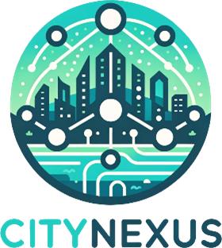
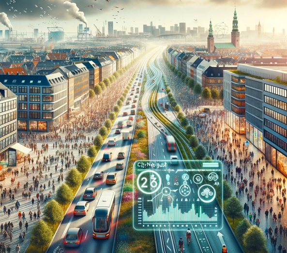
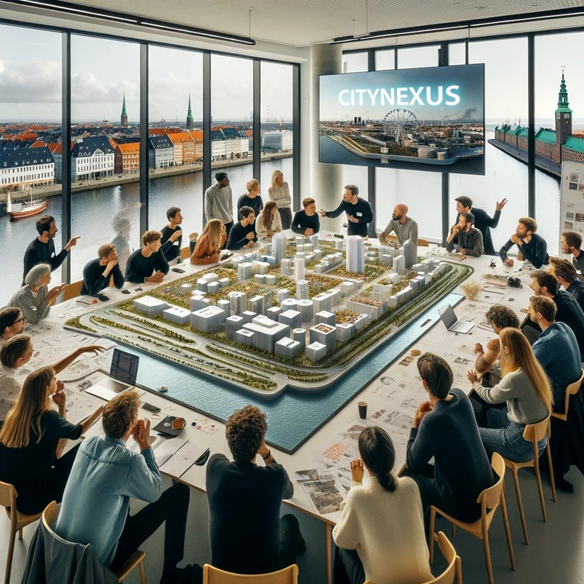

  
  <h1>CITYNEXUS<h1>
  A novel urban digital twin application

CITYNEXUS is an innovative urban digital twin application designed to assess the **environmental, social, and economic impacts of changes in road networks, mobility, and urban space design**.

Leveraging the DestinE system, CITYNEXUS aims to evaluate baseline conditions for human mobility, including key indicators like air quality, population distribution, public health, and service accessibility and integrates live what-if scenario capabilities.

The platform is designed to provide policymakers a **collaborative platform to experiment with various strategies and solutions**, considering diverse factors and variables crucial for successful and sustainable urban interventions, thereby facilitating a coordinated approach to decision-making.

<h2>Solution</h2>

The CityNexus platform, designed for the Copenhagen Greater Metropolitan Area, aims to facilitate evidence-based decision-making at the municipality level. It targets a comprehensive set of Key Performance Indicators (KPIs) across five thematic areas. These include:
1.	**Mobility Patterns**: CityNexus provides detailed insights into commuting patterns, travel behavior, traffic flows, congestion rates, peak traffic hours, and overall mobility dynamics in the city. This information is crucial for understanding and addressing the challenges of urban transport and traffic management.
2.	**Air Quality**: The platform evaluates the concentration of various pollutants at ground level, like nitrogen dioxide (NO2), sulfur dioxide (SO2), carbon monoxide (CO), ozone (O3), black carbon particles, and ultrafine particles. It leverages data from mobile mapping campaigns, in-situ stations, and advanced AI techniques to downscale Sentinel-5P data to a 100m spatial resolution, providing a precise picture of the city's air quality.
3.	**Dynamic Population Distribution**: CityNexus describes human presence patterns over time, aiding in the understanding of population movements and densities in different city areas.
4.	**Public Environmental Health**: The platform assesses how air pollution affects public health, including the incidence of diseases associated with exposure to different pollutants.
5.	**Service Accessibility**: It evaluates the availability, accessibility, and equity of key urban services such as transportation, healthcare, education, workplaces, commercial, and recreational facilities.

  
   
 

Furthermore, CityNexus offers functionalities for generating **"what if" simulations** based on four transformation scenarios, aligned with the development options being considered by the Municipality. These scenarios include high-speed road redesign, promoting electric and low-emission vehicles, creating Low Emission Zones, and adjusting road speed limits. Each scenario aims to contribute to a more sustainable, healthy, and livable urban environment in Copenhagen.

In particular, CityNexus will employ the Cloud Infrastructure, Data & User Workflow, Dashboard, Traceability and Data Visualization Services of the **Destination Earth Service Platform DESP** to deploy the application and provide access to the users. The use of explainable AI (XAI) ensures transparency and helps foster policy adoption. Users can assess the effects of different interventions on targeted KPIs and explore their compound effects in a risk-free virtual environment before real-world implementation.

This approach provides policymakers a collaborative platform to experiment with various strategies and solutions, considering diverse factors and variables crucial for successful and sustainable urban interventions, thereby facilitating a coordinated approach to decision-making.

<h2>Impact</h2>

The implementation of CityNexus and its "what-if" scenario capabilities is expected to have a profound and multi-faceted impact on users, particularly in terms of urban planning, environmental sustainability, transportation, and public health policies. In the short term, users, including urban planners, policymakers, and the public, will gain a powerful tool for visualizing and understanding the potential impacts of various urban development decisions. This interactive and participatory approach to planning will allow for more informed and community-driven decisions. By simulating different scenarios, CityNexus provides insights into how changes in infrastructure, such as transforming high-speed thoroughfares or promoting electric vehicles, can influence human mobility, air quality, and public health. This ability to evaluate the potential outcomes of various initiatives before implementation will be instrumental in guiding effective policy decisions and urban development strategies.

In the long-term, CityNexus is expected to significantly contribute to Copenhagen's journey towards a more sustainable, healthy, and smart urban future, aligning with the city's ambitious environmental and urban quality of life goals. By integrating with key policies like the Copenhagen Climate Plan and the Copenhagen Bicycle Strategy, the platform supports the city’s endeavors to become carbon-neutral by 2025 and evolve into a premier global city for cycling.

Moreover, the impact of CityNexus extends beyond regional boundaries. There is a concerted effort to connect with cities participating in the EU’s 100 Climate-Neutral and Smart Cities by 2030 initiative, as well as the Covenant of Mayors. This multi-tiered strategy not only furthers Copenhagen's local sustainability goals but also aims to inspire and motivate cities across the globe. By demonstrating the effectiveness of CityNexus in achieving substantial, long-lasting urban improvements, the project positions itself as a pioneering model for integrating advanced digital tools into urban planning and policy-making. This approach underscores the potential of collaborative, data-driven strategies in realizing the vision of sustainable, smart, and climate-neutral cities, encouraging a global movement towards more sustainable urban development.

  
   
 

<h2>Policy addressed</h2>

- **Urban planning** policies, intended as regulations, guidelines, and strategies formulated and implemented by government authorities, urban planners, and policymakers to manage and shape the development, growth, and sustainability of urban areas.
- **Environmental** planning policies, intended as regulations and strategies aimed at managing and enhancing the sustainability, livability, and ecological aspects of urban areas, with a focus on urban design, transportation, and environmental quality.
- **Transportation** Policies, intended as policies related to public transportation, traffic management, road safety, and alternative transportation modes (e.g., cycling and walking), which impact both urban and environmental planning.
- **Public Health** Policies, intended as policies that address public health concerns associated with urban environments, specifically related to air quality regulations.                               

 <h2>Data</h2>
 Various data portfolio will be used, from DestinE, publicly available and commercial.

From DestinE Portfolio:

- Sentinel-5P TROPOMI Level 2 daily tropospheric NO2, SO2, CO, O3 vertical column densities
- ECMWF's ERA5 hourly estimates for different meteorological variables
- Copernicus Digital Elevation Model of Europe available at 10m resolution
- CORINE Land Cover map available from the Copernicus Land Monitoring Service at 100m resolution

Publicly available:

- Copenhagen Air View (CAV),Near-ground air pollution levels (National and Local network), Near-ground meteorological data (National network), Road network, the OpenStreetMap (OSM), TNO/MACC-III inventory, World Settlement Footprint – WSF suite, Copenhagen’s public transportation schedule, Copenhagen’s map of municipal trees, tree canopy coverage and land use plan.

Commercial:

- High Frequency Location Based (HFLB) mobility data for entire Denmark for 20 months

## Contributions

Tho contribute to DestinE Open Source SW collections please refer to [Rule of Participation](RULE_OF_PARTICIPATION.md)

## Code of Conduct

DestinE open source community abide to this [Code of Conduct](CODE_OF_CONDUCT.md)

