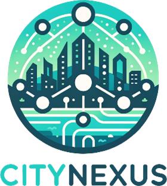

  
  <h1>CITYNEXUS<h1>
  A novel urban digital twin application

The City of Copenhagen is addressing traffic congestion and aiming for sustainable urban development in Ørestad, a mixed-use area in the Amager Vest district. This sector, comprising residential, commercial, and university buildings, with a significant population in each, plans to transform its main thoroughfare to better manage traffic, improve air quality, and enhance living standards. Central to this initiative is understanding how the outcomes of these hypotheses of transformation for human mobility, service accessibility, air quality, and public environmental health. The city has a strong interest in exploring innovative tools for interactive assessment of different spatial planning and urban development options and for evaluating tradeoffs of climate adaptation policies and regulatory changes, hence supporting data-driven decision-making in urban planning.

To respond to the needs of the Local Council of Amager Vest and the City of Copenhagen, **CityNexus** is an innovative **urban digital twin application designed to assess the environmental, social, and economic impacts of changes in road networks, mobility, and urban space design**.  CityNexus aims to evaluate baseline conditions for human mobility, including key indicators like air quality, population distribution, public health, and service accessibility and integrates live what-if scenario capabilities.

